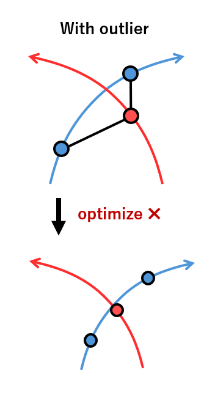
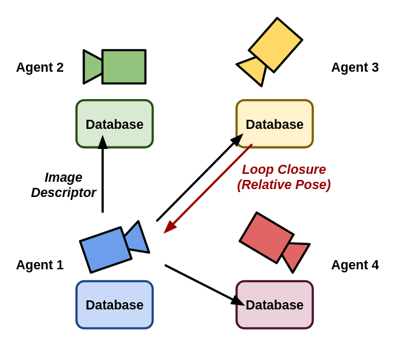
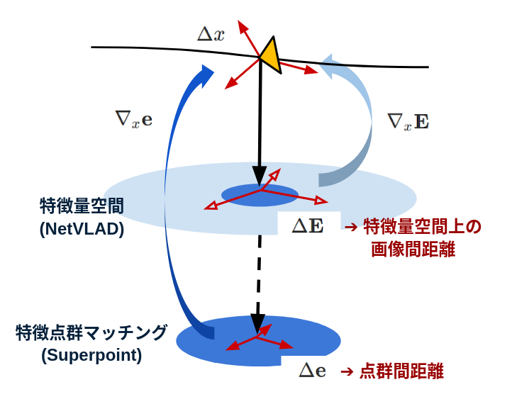
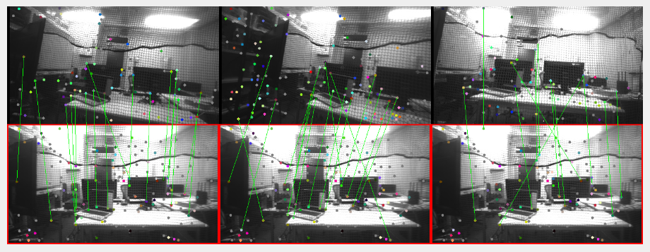
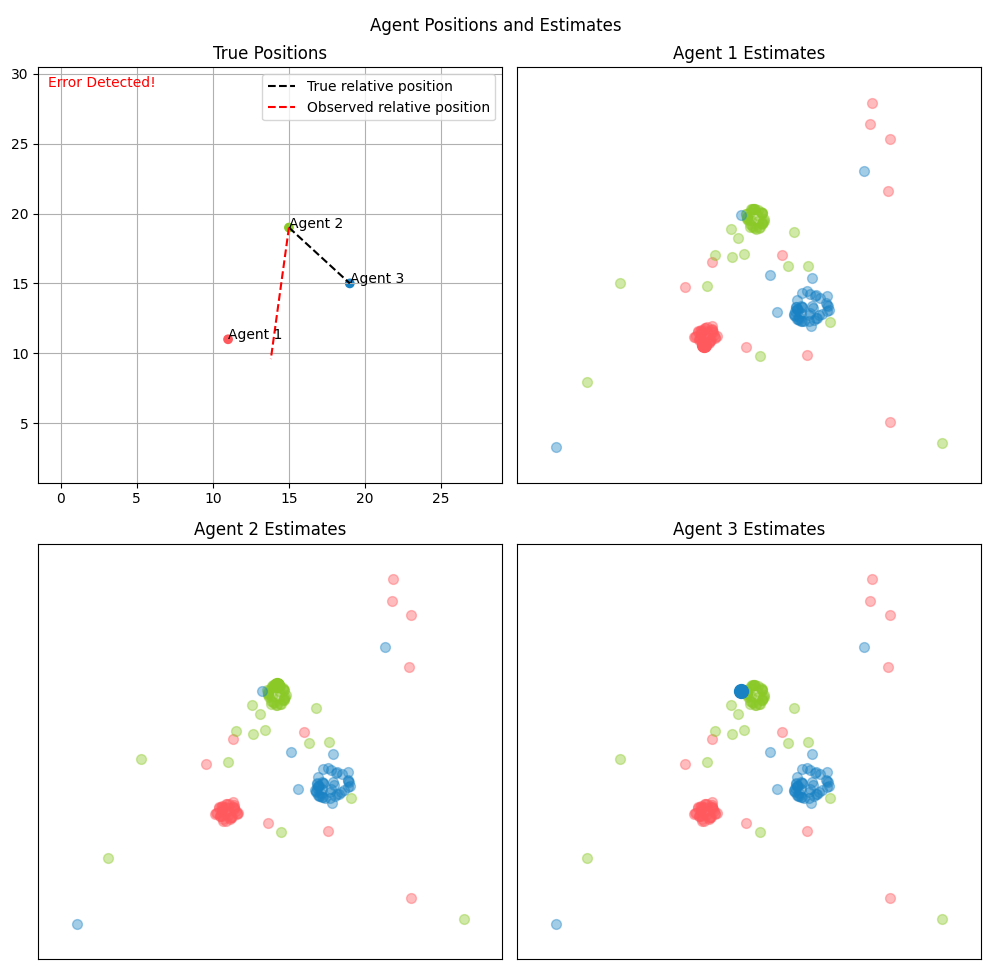
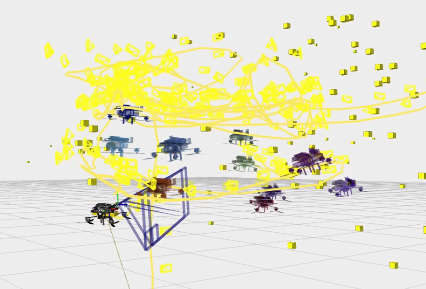
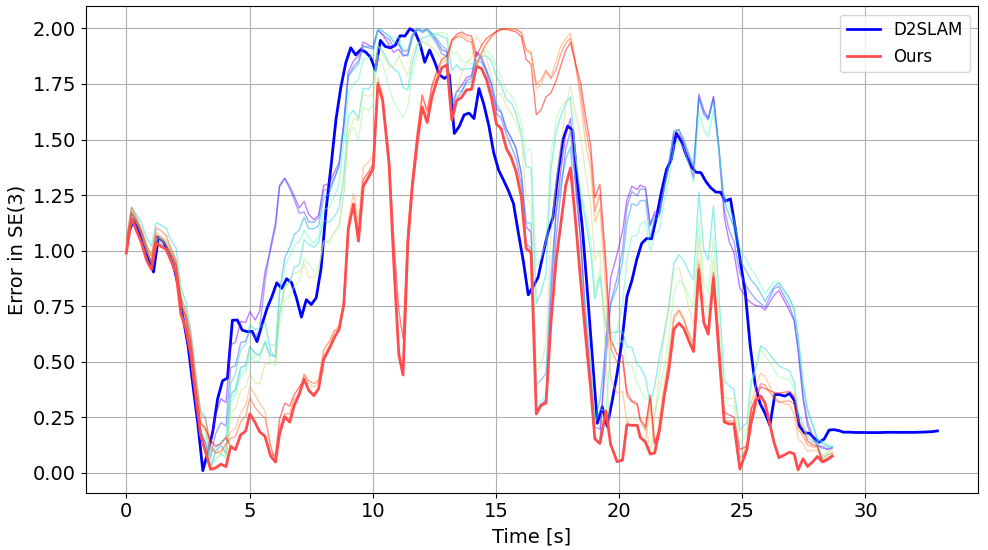

# Collaborative Localization of UAVs in Monotone Environments Using Stein Particle Filter

**著者:** Tomoki Arita$^{1\dagger}$ and Toru Namerikawa$^{2}$

**所属:**
$^{1}$School of Integrated Design Engineering, Keio University, Kanagawa, Japan  
$^{2}$Department of System Design Engineering, Keio University, Kanagawa, Japan  
(Tel: +81-45-563-1151; E-mail: arita@keio.jp, namerikawa@sd.keio.ac.jp)

## 概要

In monotone and vast outdoor environments such as farmlands and forests, global self-localization through image matching often fails due to accumulated errors and outlier effects. Particularly in collaborative estimation with multiple agents, erroneous state estimation from one agent affects all agents, causing the probability of system-wide incorrect estimation to increase exponentially with the proportion of outliers per agent. In this study, we propose a Visual Inertial Navigation System (VINS) method that uses the Stein Particle Filter to incorporate position-based likelihood into conventional image feature matching while achieving consensus on estimated states among multiple agents. The proposed method enables simultaneous handling of consensus constraints between multiple agents and multimodal distributions, achieving stable position consensus in environments with outliers, which was difficult with conventional methods. Simulation and real-world experiment (single-agent) results demonstrate that using SPF allows for more robust and flexible self-localization than existing methods by leveraging distribution approximation and gradient information. Our code and dataset are available at this URL.
農地や森林などの単調で広大な屋外環境では、画像マッチングによる大域的な自己位置推定は、誤差の蓄積や外れ値の影響により失敗することが多い。特に複数エージェントによる協調推定では、1つのエージェントの状態推定の誤りが全エージェントに影響し、システム全体の誤った推定の確率がエージェントあたりの外れ値の割合に応じて指数関数的に増加する。本研究では、従来の画像特徴マッチングに位置ベースの尤度を組み込みながら、複数エージェント間で推定状態の合意を得るためにスタイン粒子フィルタを使用する視覚慣性航法システム（VINS）手法を提案する。提案手法は、複数エージェント間の合意制約とマルチモーダル分布を同時に扱うことを可能にし、従来手法では困難であった外れ値のある環境でも安定した位置合意を実現する。シミュレーションと実世界実験（単一エージェント）の結果は、SPFを使用すると、分布近似と勾配情報を活用して、既存の方法よりも堅牢で柔軟な自己位置推定が可能になることを示している。コードとデータセットはこのURLから入手可能である。

**キーワード:** Collaborative Localization, Unmanned Aerial Vehicles, Stein Particle Filter, Monotone Environments, Visual-Inertial Navigation System.

## 1. Introduction

Many autonomous mobile robots require self-localization as the foundation for their operation. With the increasing integration of autonomous robots into society, numerous self-localization technologies for environments where GPS/GNSS is unavailable, such as harsh environments and mountainous regions, are being researched. In recent years, autonomous robots have been introduced in various domains including traffic environments, daily living environments, and harsh environments, making multi-agent environments where multiple agents operate simultaneously a major research field. Even in harsh environments and mountainous regions where GPS/GNSS is unavailable, several studies have attempted collaborative work by multiple agents from the perspectives of system-wide fault tolerance and scalability for respective objectives.
多くの自律移動ロボットは、その動作の基盤として自己位置推定を必要とする。自律移動ロボットの社会実装が進むにつれ、GPS/GNSSが利用できない過酷環境や山岳地帯などの環境下での自己位置推定技術が数多く研究されている。近年、交通環境、生活環境、過酷環境など様々な領域に自律移動ロボットが導入され、複数のエージェントが同時に動作するマルチエージェント環境が主要な研究分野となっている。GPS/GNSSが利用できない過酷環境や山岳地帯でも、システム全体の耐障害性やスケーラビリティの観点から、複数のエージェントによる協調作業を試みる研究が数多く行われており、それぞれの目的に応じた研究が行われている。

The target problem of this study is collaborative self-localization of multiple UAVs in monotone and vast outdoor environments (such as farmlands and forests) where GPS/GNSS is unavailable. In such environments, conventional global self-localization through image matching does not function adequately due to accumulated errors and outlier effects. Particularly in collaborative estimation with multiple agents, erroneous state estimation from one agent affects all agents, causing the probability of system-wide incorrect estimation to increase exponentially with the proportion of outliers.
本研究の対象問題は、GPS/GNSSが利用できない単調で広大な屋外環境（農地や森林など）における複数のUAVの協調的自己位置推定です。このような環境では、画像マッチングによる従来の大域的自己位置推定は、誤差の蓄積や外れ値の影響により十分に機能しません。特に、複数のエージェントによる協調推定では、1つのエージェントの状態推定の誤りがすべてのエージェントに影響し、外れ値の割合に応じてシステム全体の誤った推定の確率が指数関数的に増加します。

Consider a scenario where a swarm of agricultural drones monitors crop growth conditions in a vast farmland. In such an environment, the crops appear similar, and there are few geographical features, making self-localization through image matching difficult. Each drone needs to estimate its position using its own camera and IMU, and share information with other drones to collaboratively estimate its position. However, if some drones make incorrect position estimations, this misinformation can propagate to other drones, potentially reducing the position estimation accuracy of the entire system. The method proposed in this study achieves stable self-localization even in such situations.
広大な農地で多数の農業用ドローンが農作物の生育状況を監視するシナリオを考えてみましょう。このような環境では、農作物の見た目が似ており、地形的特徴も少ないため、画像マッチングによる自己位置推定は困難です。各ドローンは、自身のカメラとIMUを使用して位置を推定し、他のドローンと情報を共有して協調的に位置を推定する必要があります。しかし、一部のドローンが誤った位置推定を行った場合、その誤った情報が他のドローンに伝搬され、システム全体の位置推定精度が低下する可能性があります。本研究で提案する手法は、このような状況でも安定した自己位置推定を実現します。

The challenges of collaborative self-localization in monotone environments are primarily due to the following factors. First, monotone environments contain many similar visual features, making position estimation through image matching prone to errors. For example, in farmlands and forests, similar landscapes appear repeatedly, making feature point correspondence ambiguous. Additionally, in collaborative estimation with multiple agents, incorrect estimation by one agent affects other agents as well. Existing graph optimization-based methods (e.g., D2SLAM) break down when incorrect matching (outliers) exists. Specifically, in monotone environments, similar image matching may not function properly, and incorrect matching on the pose graph can lead to the selection of incorrect interpolation points as a result of optimization.
モノトーン環境における協調的自己位置推定の課題は、主に以下の要因によるものです。まず、モノトーン環境には多くの類似した視覚的特徴が含まれるため、画像マッチングによる位置推定は誤りが生じやすくなります。例えば、農地や森林では、類似した風景が繰り返し出現し、特徴点の対応があいまいになります。また、複数のエージェントによる協調推定では、1 つのエージェントによる誤った推定が他のエージェントにも影響を及ぼします。既存のグラフ最適化ベースの手法 (例: D2SLAM) は、誤ったマッチング (外れ値) が存在すると機能しなくなります。具体的には、モノトーン環境では類似画像マッチングが適切に機能しない可能性があり、ポーズグラフ上の誤ったマッチングにより、最適化の結果として誤った補間点が選択される可能性があります。

Existing collaborative self-localization methods primarily adopt graph optimization-based approaches, with methods like D2SLAM showing top performance. However, these methods have a fundamental limitation in that they cannot handle strongly multimodal problems. In monotone environments, multiple different positions may generate similar observations, appearing as multiple peaks (multimodality) in the probability distribution. Graph optimization-based methods cannot properly represent and process such multimodal distributions, as they seek a single optimal solution, making them prone to breakdown when outliers exist. Furthermore, existing methods lack a framework that simultaneously considers consensus constraints between multiple agents and the handling of multimodal distributions.
既存の協調的自己位置推定法は主にグラフ最適化ベースのアプローチを採用しており、D2SLAM などの方法が最高のパフォーマンスを示しています。ただし、これらの方法には、強力なマルチモーダル問題を処理できないという根本的な制限があります。単調な環境では、複数の異なる位置が同様の観測値を生成する可能性があり、確率分布に複数のピーク (マルチモーダル) として現れます。グラフ最適化ベースの方法は、単一の最適解を求めるため、外れ値が存在すると破綻する傾向があるため、このようなマルチモーダル分布を適切に表現および処理できません。さらに、既存の方法には、複数のエージェント間のコンセンサス制約とマルチモーダル分布の処理を同時に考慮するフレームワークがありません。

Therefore, in this study, we propose a Cooperative Visual Inertial System (CoVINS) method using the Stein Particle Filter. This method considers position-based likelihood in addition to conventional image feature matching, achieving consensus on estimated states among multiple agents. Specifically, we propose a new framework combining the Stein Particle Filter and Relaxed ADMM to address the problem of collaborative self-localization of UAVs in monotone wide-area environments. This enables simultaneous handling of consensus constraints between multiple agents and multimodal distributions, achieving stable position consensus in environments with outliers, which was difficult with conventional methods.
そこで本研究では、Stein Particle Filterを用いたCooperative Visual Inertial System (CoVINS)法を提案する。この手法では、従来の画像特徴マッチングに加え、位置ベースの尤度を考慮し、複数エージェント間で推定状態の合意を達成する。具体的には、Stein Particle FilterとRelaxed ADMMを組み合わせた新しいフレームワークを提案し、単調な広域環境におけるUAVの協調的自己位置推定の問題に対処する。これにより、複数エージェント間の合意制約とマルチモーダル分布を同時に扱うことが可能となり、従来手法では困難であった外れ値のある環境でも安定した位置合意が達成できる。

The main difference between the proposed method and conventional methods is the realization of collaborative self-localization at the probability distribution level. Specifically, by using a particle filter, multiple graphs that could be generated by correct and incorrect edges can be explored simultaneously. This provides ambiguity representation capability that enables estimation even in monotone environments and strongly multimodal environments. While conventional graph optimization-based methods seek a single optimal solution and are prone to breakdown when outliers exist, the proposed method represents the probability distribution as a set of particles and updates them using a gradient method based on Stein Variational Gradient Descent (SVGD), enabling proper handling of multimodal distributions.
提案手法と従来手法の主な違いは、確率分布レベルでの協調的自己位置推定の実現です。具体的には、パーティクルフィルタを使用することで、正しいエッジと間違ったエッジによって生成される可能性のある複数のグラフを同時に探索できます。これにより、単調な環境や強いマルチモーダル環境でも推定を可能にする曖昧性表現能力が得られます。従来のグラフ最適化ベースの手法は単一の最適解を求め、外れ値が存在すると破綻しがちですが、提案手法では確率分布をパーティクルの集合として表現し、SVGD（Stein Variational Gradient Descent）に基づく勾配法を使用して更新するため、マルチモーダル分布を適切に扱うことができます。

The reason for introducing collaborative self-localization at the probability distribution level is to address the multimodality problem in monotone environments. In monotone environments, multiple different positions may generate similar observations, appearing as multiple peaks in the probability distribution. Conventional graph optimization-based methods seek a single optimal solution, making them prone to breakdown when outliers exist. On the other hand, probability distribution representation using particle filters can properly represent and process such multimodal distributions. Furthermore, by using Stein Variational Gradient Descent (SVGD), the particle distribution can be smoothly transformed and converged to the target distribution. This also avoids the problem of particle degradation due to resampling. Additionally, by combining Relaxed ADMM, consensus constraints between multiple agents can be considered simultaneously.
確率分布レベルで協調的自己位置推定を導入する理由は、単調環境におけるマルチモーダル問題に対処するためです。単調環境では、複数の異なる位置が同様の観測値を生成する可能性があり、確率分布に複数のピークとして現れます。従来のグラフ最適化ベースの方法は、単一の最適解を求めるため、外れ値が存在すると破綻しがちです。一方、パーティクルフィルタを使用した確率分布表現は、このようなマルチモーダル分布を適切に表現し、処理することができます。さらに、Stein Variational Gradient Descent (SVGD) を使用することで、パーティクル分布を滑らかに変換し、目的の分布に収束させることができます。これにより、リサンプリングによるパーティクルの劣化の問題も回避できます。さらに、Relaxed ADMM を組み合わせることで、複数のエージェント間の合意制約を同時に考慮することができます。

The novelty of the proposed method includes:

* Formulation of the consensus problem for the Stein Particle Filter using Relaxed ADMM, proposing a collaborative self-localization method with powerful ambiguity representation capability
* Realization of a position estimation method applicable to real-world systems such as CoVINS through the formulation of collaborative optimization methods in 6-degree-of-freedom pose space
* Introduction of hierarchical likelihood, improving feature matching accuracy in monotone environments by using NetVLAD features for wide-area and Superpoint features for local areas
* Implementation of an algorithm capable of parallel computation of a large number of particles for multiple agents using GPUs
提案手法の新規性は次のとおりです:

* 緩和型 ADMM を使用した Stein 粒子フィルタの合意問題の定式化。強力な曖昧性表現機能を備えた協調型自己位置推定手法を提案
* 6 自由度姿勢空間での協調型最適化手法の定式化により、CoVINS などの実世界システムに適用可能な位置推定手法を実現
* 階層的尤度の導入。広域には NetVLAD 機能、局所領域には Superpoint 機能を使用することで、単調な環境での特徴マッチング精度を向上
* GPU を使用して複数のエージェントの多数の粒子を並列計算できるアルゴリズムの実装 

## 2. Related Work

This research is related to several fields. First, there is the field of Visual Inertial Systems (VINS), which combines cameras and Inertial Measurement Units (IMUs) for self-localization in environments where GPS/GNSS is unavailable. Qin et al. [1] proposed VINS-Mono, a robust and versatile VINS using a monocular camera and IMU, which is a representative study in this field.
この研究はいくつかの分野に関連しています。まず、GPS/GNSSが利用できない環境での自己位置推定のためにカメラと慣性計測装置(IMU)を組み合わせた視覚慣性システム(VINS)の分野があります。Qinら[1]は、単眼カメラとIMUを使用した堅牢で汎用性の高いVINSであるVINS-Monoを提案しており、この分野の代表的な研究です。

Next, there is the field of multi-robot collaborative SLAM (Simultaneous Localization and Mapping). Chen et al. [2] summarized an overview of multi-robot collaborative SLAM from the perspective of data fusion, classifying and comparing various approaches. Zhou et al. [3] conducted research on swarms of micro aerial robots in actual outdoor environments, demonstrating challenges and solutions for collaborative self-localization in the real world.
次に、マルチロボット協調SLAM（同時位置推定とマッピング）の分野があります。Chenら[2]は、データ融合の観点からマルチロボット協調SLAMの概要をまとめ、さまざまなアプローチを分類して比較しました。Zhouら[3]は、実際の屋外環境でマイクロ航空ロボットの群れに関する研究を行い、現実世界での協調的な自己位置推定の課題と解決策を示しました。

Additionally, there is the field of particle filters and variational inference, which are methods for solving non-Gaussian and nonlinear probabilistic state estimation problems. Liu and Wang [4] proposed Stein Variational Gradient Descent (SVGD), a general Bayesian inference algorithm that forms the basis of the Stein Particle Filter used in this study. Koide et al. [5] conducted research on accelerating the Stein Particle Filter using GPUs, achieving real-time 6-degree-of-freedom position estimation.
さらに、非ガウス分布や非線形確率状態推定問題を解く手法として、粒子フィルタや変分推論の分野がある。LiuとWang[4]は、本研究で使用したStein粒子フィルタの基礎となる一般的なベイズ推論アルゴリズムであるStein変分勾配降下法（SVGD）を提案した。Koideら[5]は、GPUを使用してStein粒子フィルタを高速化する研究を行い、リアルタイムで6自由度の位置推定を実現した。

Visual Inertial Systems (VINS) combine cameras and Inertial Measurement Units (IMUs) for self-localization and are widely used in environments where GPS/GNSS is unavailable. Qin et al. [1] proposed VINS-Mono, a robust and versatile VINS using a monocular camera and IMU, integrating feature point tracking, IMU pre-integration, loop detection, and other functions. Bloesch et al. [6] proposed an extended Kalman filter-based VINS using direct photometric feedback, achieving a method that does not depend on feature point extraction. Forster et al. [7] proposed a real-time VINS using pre-integration on manifolds, demonstrating an efficient method for processing IMU measurements. These studies focus on single agents and do not adequately address the challenges of multiple agent collaboration or monotone environments.
視覚慣性システム（VINS）は、カメラと慣性計測装置（IMU）を組み合わせて自己位置推定を行うもので、GPS/GNSSが利用できない環境で広く使用されています。Qinら[1]は、単眼カメラとIMUを使用し、特徴点追跡、IMU事前積分、ループ検出などの機能を統合した堅牢で多用途なVINSであるVINS-Monoを提案しました。Bloeschら[6]は、直接測光フィードバックを使用した拡張カルマンフィルタベースのVINSを提案し、特徴点抽出に依存しない方法を実現しました。Forsterら[7]は、多様体上での事前積分を使用したリアルタイムVINSを提案し、IMU測定値を処理する効率的な方法を実証しました。これらの研究は単一のエージェントに焦点を当てており、複数エージェントのコラボレーションや単調な環境の課題に十分に対処していません。

Multi-robot collaborative SLAM is a method where multiple robots cooperate to map the environment and estimate their positions. Chen et al. [2] summarized an overview of multi-robot collaborative SLAM from the perspective of data fusion, classifying and comparing various approaches such as centralized, distributed, and decentralized. Zhou et al. [3] conducted research on swarms of micro aerial robots in actual outdoor environments, demonstrating challenges and solutions for collaborative self-localization in the real world. Xu et al. [8] proposed D2SLAM, a distributed and decentralized collaborative Visual-Inertial SLAM system, achieving efficient collaborative self-localization for aerial swarms. These studies focus on the collaboration of multiple agents but do not adequately address robustness to outliers in monotone environments or the processing of multimodal distributions.
マルチロボット協調SLAMは、複数のロボットが協力して環境をマッピングし、位置を推定する方法です。Chenら[2]は、データ融合の観点からマルチロボット協調SLAMの概要をまとめ、集中型、分散型、分散型などのさまざまなアプローチを分類して比較しました。Zhouら[3]は、実際の屋外環境でのマイクロ航空ロボットの群れの研究を行い、現実世界での協調的自己位置推定の課題と解決策を示しました。Xuら[8]は、分散型および分散型の協調Visual-Inertial SLAMシステムであるD2SLAMを提案し、航空群の効率的な協調的自己位置推定を実現しました。これらの研究は、複数のエージェントのコラボレーションに焦点を当てていますが、単調な環境での外れ値に対する堅牢性やマルチモーダル分布の処理には十分に対処していません。

Particle filters and variational inference are methods for solving non-Gaussian and nonlinear probabilistic state estimation problems. Liu and Wang [4] proposed Stein Variational Gradient Descent (SVGD), a general Bayesian inference algorithm that forms the basis of the Stein Particle Filter used in this study. Maken et al. [9] proposed the Stein Particle Filter, a method for nonlinear and non-Gaussian state estimation, solving the problem of particle degradation due to resampling in conventional particle filters. Koide et al. [5] conducted research on accelerating the Stein Particle Filter using GPUs, achieving real-time 6-degree-of-freedom position estimation. These studies focus on the theory and application of particle filters and variational inference but do not adequately address the combination with multiple agent collaboration or consensus problems.
パーティクルフィルタと変分推論は、非ガウスおよび非線形確率状態推定問題を解決する方法です。LiuとWang[4]は、本研究で使用したSteinパーティクルフィルタの基礎となる一般的なベイズ推論アルゴリズムであるStein変分勾配降下法（SVGD）を提案しました。Makenら[9]は、従来のパーティクルフィルタでの再サンプリングによるパーティクル劣化の問題を解決する、非線形非ガウス状態推定法であるSteinパーティクルフィルタを提案しました。Koideら[5]は、GPUを使用してSteinパーティクルフィルタを高速化する研究を行い、リアルタイムの6自由度の位置推定を実現しました。これらの研究は、パーティクルフィルタと変分推論の理論と応用に焦点を当てていますが、複数エージェントのコラボレーションやコンセンサスの問題との組み合わせについては十分に対処していません。

Related publications from our lab include:

* "Cooperative Visual-Inertial SLAM for Multiple UAVs"
* "Robust Particle Filter-Based Cooperative Localization in GPS-Denied Environments"
* "Multi-Agent Formation Control with Distributed Optimization"

Standard benchmarks in the field of collaborative self-localization include the following. First, the EuRoC MAV dataset is a standard dataset containing stereo images, IMU data, and ground truth position information collected by micro aerial vehicles (MAVs), commonly used for evaluating single-agent VINS. The KITTI Vision Benchmark is a dataset collected from autonomous driving vehicles, containing stereo images, LiDAR scans, and GPS data, widely used for evaluating self-localization in outdoor environments. The TUM RGB-D dataset provides RGB-D images and ground truth position information in indoor environments, suitable for evaluating vision-based SLAM. Recently, synthetic datasets using simulators such as AirSim, CARLA, and Gazebo have also increased, particularly used for evaluating collaborative self-localization of multiple agents. However, there are still few benchmarks specialized for collaborative self-localization of multiple UAVs in monotone environments, and the development of datasets corresponding to specific challenges like those in this study remains a future task.
当研究室の関連出版物には、次のものがあります。

* 「複数の UAV 向けの協調型視覚慣性 SLAM」
* 「GPS が利用できない環境での堅牢なパーティクル フィルタ ベースの協調型位置特定」
* 「分散最適化によるマルチエージェント フォーメーション コントロール」

協調型自己位置特定分野の標準ベンチマークには、次のものがあります。まず、EuRoC MAV データセットは、マイクロ航空機 (MAV) によって収集されたステレオ画像、IMU データ、および地上位置情報を含む標準データセットで、シングル エージェント VINS の評価によく使用されます。KITTI Vision Benchmark は、自律走行車両から収集されたデータセットで、ステレオ画像、LiDAR スキャン、および GPS データを含み、屋外環境での自己位置特定を評価するために広く使用されています。TUM RGB-D データセットは、屋内環境での RGB-D 画像と地上位置情報を提供し、視覚ベースの SLAM の評価に適しています。最近では、AirSim、CARLA、Gazeboなどのシミュレータを用いた合成データセットも増えており、特に複数エージェントの協調的自己位置推定の評価に利用されています。しかし、単調な環境における複数UAVの協調的自己位置推定に特化したベンチマークはまだ少なく、本研究のような特定の課題に対応したデータセットの開発は今後の課題となっています。

The main differences between the proposed method and similar methods are as follows.

First, the difference with D2SLAM [8] lies in the representation of probability distributions. D2SLAM is a graph optimization-based method that adopts an approach seeking a single optimal solution. In contrast, the proposed method represents the probability distribution using a particle filter and updates it using a gradient method based on Stein Variational Gradient Descent (SVGD). This enables proper handling of multimodal distributions and robust estimation even in environments with outliers.

Next, the difference with MegaParticles [5] lies in the handling of multiple agent collaboration and consensus problems. MegaParticles focuses on accelerating the Stein Particle Filter using GPUs but is limited to single-agent position estimation. The proposed method combines Relaxed ADMM to realize a framework that can simultaneously consider consensus constraints between multiple agents.

Additionally, the difference with conventional Cooperative VINS methods [10] lies in robustness to outliers in monotone environments. Conventional Cooperative VINS methods primarily focus on improving feature point matching accuracy and efficient information sharing but do not adequately consider robustness to outliers in monotone environments. The proposed method introduces hierarchical likelihood, using NetVLAD features for wide-area and Superpoint features for local areas to improve feature matching accuracy in monotone environments.
提案手法と類似手法との主な違いは以下の通りである。

まず、D2SLAM [8] との違いは確率分布の表現にある。D2SLAM はグラフ最適化に基づく手法であり、単一の最適解を求めるアプローチを採用している。これに対し、提案手法では確率分布をパーティクルフィルタで表現し、Stein Variational Gradient Descent (SVGD) に基づく勾配法で更新する。これにより、マルチモーダル分布を適切に処理し、外れ値のある環境でもロバストな推定が可能になる。

​​次に、MegaParticles [5] との違いは、複数エージェントのコラボレーションとコンセンサス問題の処理にある。MegaParticles は、GPU を使用して Stein Particle Filter を高速化することに重点を置いているが、単一エージェントの位置推定に限定されている。提案手法では、Relaxed ADMM を組み合わせて、複数エージェント間のコンセンサス制約を同時に考慮できるフレームワークを実現している。

さらに、従来の Cooperative VINS 手法 [10] との違いは、単調な環境での外れ値に対する堅牢性にある。従来の協調型 VINS 法は、主に特徴点のマッチング精度と効率的な情報共有の向上に重点を置いていますが、単調な環境での外れ値に対する堅牢性を十分に考慮していません。提案された方法は、階層的尤度を導入し、広域には NetVLAD 特徴を使用し、局所領域にはスーパーポイント特徴を使用して、単調な環境での特徴マッチング精度を向上させます。
## 3. Problem Statement

The task addressed in this study is "Collaborative Localization of UAVs in Monotone Environments." In this task, multiple UAVs (Unmanned Aerial Vehicles) cooperate to estimate their positions in monotone and vast outdoor environments (such as farmlands and forests) where GPS/GNSS is unavailable. Each UAV is equipped with a camera and an Inertial Measurement Unit (IMU) and estimates its position through these sensor information and communication with other UAVs. Particularly in monotone environments, there are many similar visual features, making position estimation through image matching prone to errors, and stable self-localization is required even in situations where these outliers exist.

In this task, it is desirable for each UAV to accurately estimate its 6-degree-of-freedom position and orientation (state on SE(3)). Specifically, a solution satisfying the following conditions is desirable:

1. The estimated position and orientation of each UAV are close to the true position and orientation (low estimation error)
2. The relative position relationships between multiple UAVs are accurately estimated (consistent estimation)
3. Stable estimation is maintained even in the presence of outliers (incorrect matching) in monotone environments (robustness)
4. Multimodal distributions can be properly represented and processed (ambiguity representation capability)
5. Estimated states are agreed upon between multiple UAVs (consensus)
6. Computational efficiency capable of real-time operation (real-time capability)

A solution satisfying these conditions is considered effective in the collaborative self-localization task in monotone environments.

As shown in Fig. 1, Collaborative Visual Inertial System (CoVINS) is a representative example of collaborative self-localization by multiple UAVs. There are N agents equipped with cameras and Inertial Measurement Units (IMUs), and each agent transmits the image information observed by its camera to adjacent agents. The agent receiving the image information searches within the database held by each agent, detects images observing the same landmark, and sends back the relative position between camera frames in the two images. In the context of graph optimization, each agent creates a pose graph, which is a graph of relative positions, using the obtained relative position information. If a pose graph can be generated that reproduces each obtained relative position as a result of optimization, it can be said that consistent position estimation has been achieved.

本研究で扱うタスクは「単調環境における無人航空機の協調的自己位置推定」である。このタスクでは、GPS/GNSSが利用できない単調で広大な屋外環境（農地や森林など）において、複数の無人航空機（UAV）が協力して自らの位置を推定する。各UAVはカメラと慣性計測装置（IMU）を搭載しており、これらのセンサー情報や他のUAVとの通信を通じて自らの位置を推定する。特に単調環境では類似した視覚的特徴が多く、画像マッチングによる位置推定では誤差が生じやすく、こうした外れ値が存在する状況でも安定した自己位置推定が求められる。

このタスクでは、各UAVが6自由度の位置と姿勢（SE(3)上の状態）を正確に推定することが望ましい。具体的には、以下の条件を満たすソリューションが望ましい:

1. 各 UAV の推定位置と方向が実際の位置と方向に近い (推定誤差が低い)

2. 複数の UAV 間の相対的な位置関係が正確に推定される (一貫した推定)

3. 単調な環境で外れ値 (不正確なマッチング) があっても安定した推定が維持される (堅牢性)

4. マルチモーダル分布を適切に表現および処理できる (曖昧さ表現能力)

5. 推定状態が複数の UAV 間で合意される (コンセンサス)

6. リアルタイム操作が可能な計算効率 (リアルタイム機能)

これらの条件を満たすソリューションは、単調な環境での協調的自己位置推定タスクに有効であると考えられます。

図 1 に示すように、協調視覚慣性システム (CoVINS) は、複数の UAV による協調的自己位置推定の代表的な例です。カメラと慣性計測装置（IMU）を搭載したN個のエージェントがあり、各エージェントはカメラで観測した画像情報を隣接するエージェントに送信する。画像情報を受け取ったエージェントは、各エージェントが保持するデータベース内を検索し、同じランドマークを観測している画像を検出し、2つの画像におけるカメラフレーム間の相対位置を返す。グラフ最適化の文脈では、各エージェントは得られた相対位置情報を用いて、相対位置のグラフであるポーズグラフを作成する。最適化の結果、得られた各相対位置を再現するポーズグラフが生成できれば、一貫した位置推定が実現できたと言える。


*Fig. 1: Collaborative Visual Inertial System (CoVINS)*

The inputs given in this task are as follows:

1. Camera images from each UAV: Visual information obtained from cameras mounted on UAVs
2. IMU data from each UAV: Inertial information (acceleration and angular velocity) obtained from accelerometers and gyroscopes
3. Communication data between UAVs: Image information and relative position information received from other UAVs
4. Initial position and orientation: Initial state of each UAV (optional, if available)
5. Prior information about the environment: Maps, feature point databases, etc. (optional, if available)

Using these inputs, each UAV estimates its position and orientation, and collaborates with other UAVs to improve the overall position estimation accuracy.

The outputs required in this task are as follows:

1. 6-degree-of-freedom position and orientation estimation values for each UAV: Position and orientation of each UAV represented as states on SE(3)
2. Estimation uncertainty: Probability distribution of position and orientation estimation (represented as a set of particles)
3. Relative position relationships between UAVs: Relative position and orientation relationships between each UAV
4. Confidence indicator: Indicator showing the reliability of estimation results (optional)
5. Environment map: Feature point map of the environment (optional, if performing SLAM)

Using these outputs, each UAV can understand its position and orientation and collaborate to accomplish its mission. Additionally, by outputting the probability distribution representing the estimation uncertainty, it can appropriately respond to strongly multimodal problems.
このタスクで与えられる入力は次のとおりです:

1. 各 UAV からのカメラ画像: UAV に搭載されたカメラから取得した視覚情報

2. 各 UAV からの IMU データ: 加速度計とジャイロスコープから取得した慣性情報 (加速度と角速度)

3. UAV 間の通信データ: 他の UAV から受信した画像情報と相対位置情報

4. 初期位置と方向: 各 UAV の初期状態 (利用可能な場合はオプション)

5. 環境に関する事前情報: マップ、特徴点データベースなど (利用可能な場合はオプション)

これらの入力を使用して、各 UAV は自身の位置と方向を推定し、他の UAV と連携して全体的な位置推定精度を向上させます。

このタスクで必要な出力は以下のとおりです。

1. 各 UAV の 6 自由度の位置と向きの推定値: SE(3) 上の状態として表される各 UAV の位置と向き

2. 推定の不確実性: 位置と向きの推定の確率分布 (粒子の集合として表される)

3. UAV 間の相対的な位置関係: 各 UAV 間の相対的な位置と向きの関係

4. 信頼性インジケータ: 推定結果の信頼性を示すインジケータ (オプション)

5. 環境マップ: 環境の特徴点マップ (SLAM を実行する場合はオプション)

これらの出力を使用して、各 UAV は自身の位置と向きを理解し、協力してミッションを達成できます。さらに、推定の不確実性を表す確率分布を出力することで、強力なマルチモーダル問題に適切に対応できます。

The main terms used in this research are defined as follows:

* UAV (Unmanned Aerial Vehicle): An unmanned aircraft. In this study, it refers to an autonomous flyable drone equipped with a camera and IMU.
* VINS (Visual Inertial System): A self-localization system combining a camera and IMU.
* CoVINS (Collaborative Visual Inertial System): A system where multiple UAVs collaboratively perform self-localization.
* SE(3): 3D Special Euclidean group. A mathematical framework for representing 6-degree-of-freedom position and orientation.
* SO(3): 3D Special Orthogonal group. A mathematical framework for representing 3D rotation.
* Stein Particle Filter (SPF): A particle filter based on Stein Variational Gradient Descent (SVGD).
* SVGD (Stein Variational Gradient Descent): A variational inference method that minimizes the Kullback-Leibler divergence using the Stein operator.
* Relaxed ADMM (Alternating Direction Method of Multipliers): A method for solving convex optimization problems with consensus constraints.
* Multimodal distribution: A probability distribution with multiple peaks. In monotone environments, multiple different positions may generate similar observations, appearing as multiple peaks in the probability distribution.
* Outlier: A data point that deviates significantly from the true value, caused by incorrect matching or observation.
* NetVLAD: A neural network architecture for extracting global features from images.
* Superpoint: A neural network for extracting local feature points from images.

This study assumes the following points and does not address these challenges:

1. It is assumed that each UAV is equipped with a camera and IMU, and other sensor configurations are not considered.
2. Communication between UAVs is ideal, and problems such as communication delays or disruptions are not addressed.
3. The dynamics model and control of each UAV are not considered, focusing purely on the state estimation problem.
4. The presence of dynamic objects in the environment is not considered, assuming a static environment.
5. It is assumed that the calibration of the camera and IMU of each UAV has been performed in advance.
6. Computational resource constraints are considered, but it is assumed that a GPU is available.
7. It is assumed that the initial position and orientation are roughly known, and the global initialization problem is not addressed.
8. The focus is on the difficulty of feature point matching in monotone environments, and other environmental factors (lighting changes, weather changes, etc.) are not considered.

By making these assumptions, this study can focus on the core challenges of collaborative self-localization in monotone environments.
本研究で用いられる主な用語の定義は以下のとおりです。

* UAV (Unmanned Aerial Vehicle): 無人航空機。本研究ではカメラとIMUを搭載した自律飛行可能なドローンを指します。

* VINS (Visual Inertial System): カメラとIMUを組み合わせた自己位置推定システム。

* CoVINS (Collaborative Visual Inertial System): 複数のUAVが協調して自己位置推定を行うシステム。

* SE(3): 3D特殊ユークリッド群。6自由度の位置と向きを表現する数学的枠組み。

* SO(3): 3D特殊直交群。3D回転を表現する数学的枠組み。

* Steinパーティクルフィルタ (SPF): Stein変分勾配降下法 (SVGD) に基づくパーティクルフィルタ。
* SVGD (Stein 変分勾配降下法): Stein 演算子を使用して Kullback-Leibler ダイバージェンスを最小化する変分推論法。
* 緩和 ADMM (交互方向乗数法): 合意制約付きの凸最適化問題を解く方法。
* マルチモーダル分布: 複数のピークを持つ確率分布。単調な環境では、複数の異なる位置が同様の観測値を生成する可能性があり、確率分布に複数のピークとして表示されます。
* 外れ値: 誤ったマッチングまたは観測によって、真の値から大幅に逸脱したデータ ポイント。
* NetVLAD: 画像からグローバルな特徴を抽出するニューラル ネットワーク アーキテクチャ。
* Superpoint: 画像からローカルな特徴点を抽出するニューラル ネットワーク。

この研究では、次の点を前提としており、これらの課題には対処していません。

1. 各 UAV にはカメラと IMU が装備されていると想定しており、その他のセンサー構成は考慮していません。
2. UAV 間の通信は理想的であり、通信の遅延や中断などの問題は考慮されていません。
3. 各 UAV のダイナミクス モデルと制御は考慮されておらず、状態推定の問題にのみ焦点が当てられています。
4. 環境内の動的オブジェクトの存在は考慮されておらず、静的な環境を想定しています。
5. 各 UAV のカメラと IMU のキャリブレーションは事前に実行されていると想定されています。
6. 計算リソースの制約は考慮されていますが、GPU が利用可能であると想定されています。
7. 初期位置と方向は大まかにわかっていると想定されており、グローバル初期化の問題は考慮されていません。
8. 単調な環境での特徴点のマッチングの難しさに焦点が当てられており、他の環境要因 (照明の変化、天候の変化など) は考慮されていません。

これらの仮定を行うことで、本研究では単調な環境での協調的自己位置推定の中心的な課題に焦点を当てることができます。

The evaluation metrics used for this task are as follows:

1. Absolute Position Error (APE): Euclidean distance between the estimated position and the true position (ground truth). Unit is meters (m).
2. Absolute Orientation Error (AOE): Angular difference between the estimated orientation and the true orientation. Unit is degrees (°) or radians (rad).
3. Relative Position Error (RPE): Estimation error of relative positions between UAVs. Unit is meters (m).
4. Success Rate: Percentage of successful accurate position estimation in environments with outliers. Unit is percent (%).
5. Convergence Time: Time until the particle distribution converges. Unit is seconds (s).
6. Computation Time: Computation time per step. Unit is milliseconds (ms).
7. Outlier Tolerance: Maximum proportion of outliers for which the system can maintain accurate position estimation. Unit is percent (%).

Using these evaluation metrics, the performance of the proposed method is compared with existing methods to evaluate the effectiveness of collaborative self-localization in monotone environments.

In this study, both real-world experiments and simulations are used, but simulations are emphasized particularly for systematically evaluating the impact of outliers. The reasons are as follows:

1. Controlled experimental environment: In simulations, the proportion and distribution of outliers can be accurately controlled, allowing for systematic evaluation of the robustness of the method. In real-world experiments, it is difficult to control the occurrence of outliers.

2. Accuracy of ground truth: In simulations, completely accurate ground truth can be obtained, providing high reliability for evaluation. In real-world experiments, the ground truth itself may contain errors.

3. Reproducibility and fairness: Simulations are completely reproducible, allowing for fair comparison between different methods. In real-world experiments, reproducibility may decrease due to changes in environmental conditions.

4. Safety and cost: Real-world experiments using multiple UAVs have risks of collision and equipment damage, and are also costly. Simulations can be conducted without these risks.

5. Efficiency of parameter exploration: In simulations, numerous parameter settings can be efficiently tested. In real-world experiments, each setting trial requires time and resources.

However, since simulations alone cannot completely reproduce the complexity of the real world, limited real-world experiments (single-agent) are also conducted to confirm the effectiveness of the proposed method. Ultimately, the effectiveness and scalability of the proposed method in the real world will be further verified through larger-scale real-world experiments.
このタスクに使用される評価指標は次のとおりです。

1. 絶対位置誤差 (APE): 推定位置と実際の位置 (地上値) 間のユークリッド距離。単位はメートル (m)。

2. 絶対方向誤差 (AOE): 推定方向と実際の方向間の角度差。単位は度 (°) またはラジアン (rad)。

3. 相対位置誤差 (RPE): UAV 間の相対位置の推定誤差。単位はメートル (m)。

4. 成功率: 外れ値のある環境での正確な位置推定の成功率。単位はパーセント (%)。

5. 収束時間: 粒子分布が収束するまでの時間。単位は秒 (s)。

6. 計算時間: ステップあたりの計算時間。単位はミリ秒 (ms)。

7. 外れ値許容度: システムが正確な位置推定を維持できる外れ値の最大割合。単位はパーセント (%)。

これらの評価指標を使用して、提案手法の性能を既存の手法と比較し、単調な環境における協調的自己位置推定の有効性を評価する。

本研究では、実世界の実験とシミュレーションの両方を使用するが、外れ値の影響を体系的に評価するためには、特にシミュレーションが重視される。その理由は以下のとおりである。

1. 制御された実験環境: シミュレーションでは、外れ値の割合と分布を正確に制御できるため、手法の堅牢性を体系的に評価できる。実世界の実験では、外れ値の発生を制御することは困難である。

2. グラウンドトゥルースの精度: シミュレーションでは、完全に正確なグラウンドトゥルースを取得できるため、評価の信頼性が高い。実世界の実験では、グラウンドトゥルース自体にエラーが含まれる可能性がある。

3. 再現性と公平性: シミュレーションは完全に再現可能であり、異なる手法間の公平な比較が可能。実世界の実験では、環境条件の変化により再現性が低下する可能性がある。

4. 安全性とコスト: 複数の UAV を使用した実際の実験では、衝突や機器の損傷のリスクがあり、コストもかかります。シミュレーションでは、これらのリスクなしで実行できます。

5. パラメータ探索の効率: シミュレーションでは、多数のパラメータ設定を効率的にテストできます。実際の実験では、各設定の試行に時間とリソースが必要です。

ただし、シミュレーションだけでは現実世界の複雑さを完全に再現できないため、提案手法の有効性を確認するために、限定的な現実世界の実験 (シングルエージェント) も実施されます。最終的には、より大規模な現実世界の実験を通じて、現実世界での提案手法の有効性とスケーラビリティをさらに検証します。

## 4. Methodology

We propose a Cooperative Visual Inertial System (CoVINS) method that incorporates position-based likelihood into conventional image feature matching using the Stein Particle Filter. This study extends the Stein Particle Filter (SPF) and Relaxed Alternating Direction Method of Multipliers (ADMM) to propose a new framework called Stein Relaxed ADMM for collaborative self-localization in monotone environments. SPF is a method for numerically analyzing non-Gaussian and nonlinear probabilistic state estimation problems, extending the basic framework proposed by Maken et al. [9]. Additionally, Relaxed ADMM is a distributed optimization method proposed by Bastianello et al. [11], which we extend to apply to consensus problems of probability distributions.

The extensions made in the proposed method are widely applicable to other existing methods for the following reasons:

1. Generalization of consensus problems for probability distributions: The proposed method provides a general framework for applying Relaxed ADMM to consensus problems of probability distributions. This framework can be applied not only to particle filters but also to other probability distribution representation methods such as Gaussian mixture models and variational autoencoders.

2. Generalization of gradient calculation on SE(3): The proposed method generalizes gradient calculation on SE(3), which can be applied to gradient-based optimization methods other than SVGD (stochastic gradient descent, Adam, RMSprop, etc.).

3. Generalization of hierarchical likelihood: The hierarchical likelihood framework introduced in the proposed method (NetVLAD features for wide-area, Superpoint features for local areas) can be applied to other feature extraction methods (SIFT, ORB, DenseVLAD, etc.) and other sensor modalities (LiDAR, radar, etc.).

4. Generalization of GPU parallel computation: The GPU implementation of the proposed method can be applied to other particle-based methods (conventional particle filters, Unscented Particle Filter, Gaussian Particle Filter, etc.).

5. Generalization of multimodal distribution processing: The multimodal distribution processing framework of the proposed method can be applied to other collaborative estimation problems (collaborative object tracking, collaborative mapping, etc.).

These extensions are not dependent on specific methods but are based on general principles of probabilistic state estimation and distributed optimization, making them widely applicable.

The main differences between the proposed method (Stein Relaxed ADMM) and existing methods are summarized in Table 1. The proposed method represents probability distributions non-parametrically using particles, employs gradient-based optimization through SVGD, handles multimodal distributions, and achieves consensus at the distribution level using Relaxed ADMM. In contrast, existing methods typically use single optimal solutions or Gaussian distributions, rely on graph optimization or Kalman filtering, process only single modes, and achieve consensus at the point estimation level.
本研究では、位置ベースの尤度を Stein 粒子フィルタを使用した従来の画像特徴マッチングに組み込んだ CoVINS (Cooperative Visual Inertial System) 法を提案します。本研究では、Stein 粒子フィルタ (SPF) と緩和交互方向乗算法 (ADMM) を拡張して、単調な環境での協調的自己位置特定のための Stein 緩和 ADMM と呼ばれる新しいフレームワークを提案します。SPF は、非ガウスおよび非線形確率状態推定問題を数値的に解析する方法であり、Maken ら [9] によって提案された基本フレームワークを拡張したものです。さらに、緩和 ADMM は Bastianello ら [11] によって提案された分散最適化方法であり、確率分布のコンセンサス問題に適用できるように拡張されています。

提案された方法で行われた拡張は、次の理由により、他の既存の方法に広く適用できます。

1. 確率分布のコンセンサス問題の一般化: 提案された方法は、緩和 ADMM を確率分布のコンセンサス問題に適用するための一般的なフレームワークを提供します。このフレームワークは、粒子フィルタだけでなく、ガウス混合モデルや変分オートエンコーダなどの他の確率分布表現方法にも適用できます。

2. SE(3) での勾配計算の一般化: 提案手法は、SE(3) での勾配計算を一般化します。これは、SVGD 以外の勾配ベースの最適化手法 (確率的勾配降下法、Adam、RMSprop など) に適用できます。

3. 階層的尤度の一般化: 提案手法で導入された階層的尤度フレームワーク (広域用の NetVLAD 特徴、局所領域用の Superpoint 特徴) は、他の特徴抽出手法 (SIFT、ORB、DenseVLAD など) や他のセンサー モダリティ (LiDAR、レーダーなど) に適用できます。

4. GPU 並列計算の一般化: 提案手法の GPU 実装は、他の粒子ベースの手法 (従来の粒子フィルタ、無香料粒子フィルタ、ガウス粒子フィルタなど) に適用できます。

5. マルチモーダル分布処理の一般化: 提案手法のマルチモーダル分布処理フレームワークは、他の協調推定問題 (協調オブジェクト追跡、協調マッピングなど) にも適用できます。

これらの拡張は特定の手法に依存せず、確率的状態推定と分散最適化の一般原則に基づいているため、幅広く適用できます。

提案手法 (Stein Relaxed ADMM) と既存の手法の主な違いを表 1 にまとめます。提案手法では、粒子を使用して確率分布をノンパラメトリックに表現し、SVGD による勾配ベースの最適化を採用し、マルチモーダル分布を処理し、Relaxed ADMM を使用して分布レベルで合意に達します。対照的に、既存の手法では、通常、単一の最適解またはガウス分布を使用し、グラフ最適化またはカルマン フィルタリングに依存し、単一モードのみを処理し、ポイント推定レベルで合意に達します。

**Table 1: Comparison between the proposed method and existing methods**

| **Aspect** | **Proposed Method** | **Existing Methods** |
|------------|---------------------|----------------------|
| Probability distribution representation | Non-parametric representation using particles | Single optimal solution or Gaussian distribution |
| Optimization approach | Gradient method based on SVGD | Graph optimization or extended Kalman filter |
| Multimodal distribution handling | Simultaneous representation of multiple modes | Single mode processing |
| Consensus approach | Distribution-level consensus via Relaxed ADMM | Point estimation consensus |
| Outlier handling | Natural reduction through distribution shape | Robust estimators or outlier removal |
| Feature utilization | Hierarchical likelihood (NetVLAD + Superpoint) | Single-level features (SIFT, ORB) |
| Computational implementation | GPU-accelerated parallel processing | Mainly CPU-based implementation |
| Theoretical framework | KL divergence minimization with consensus constraints | Maximum likelihood or MAP estimation |

Fig. 2 shows the model structure of the proposed method. The method integrates several key components to achieve collaborative self-localization in monotone environments. The prediction step uses IMU data for numerical integration to predict particle states. The hierarchical likelihood calculation combines NetVLAD features for wide-area recognition with Superpoint features for local matching. SVGD updates particles based on likelihood and consensus constraints, while Relaxed ADMM ensures consensus between multiple agents. GPU parallel computation enables efficient processing of numerous particles.
図 2 は、提案手法のモデル構造を示しています。この手法では、いくつかの主要コンポーネントを統合して、単調な環境で協調的な自己位置特定を実現します。予測ステップでは、数値積分に IMU データを使用して粒子の状態を予測します。階層的尤度計算では、広域認識用の NetVLAD 機能とローカル マッチング用の Superpoint 機能を組み合わせます。SVGD は尤度とコンセンサス制約に基づいて粒子を更新し、Relaxed ADMM は複数のエージェント間のコンセンサスを確保します。GPU 並列計算により、多数の粒子を効率的に処理できます。


*Fig. 2: Model structure of the proposed method*

The mathematical foundation of our approach combines Stein Variational Gradient Descent with Relaxed ADMM to solve the collaborative localization problem. This integration allows us to handle both multimodal distributions and consensus constraints simultaneously.

The proposed method consists of five integrated modules that work together to achieve collaborative self-localization in monotone environments:

**IMU Preintegration Module:** This module numerically integrates acceleration and angular velocity data from the IMU to calculate state transitions on SE(3). Integration on manifolds properly handles the nonlinearity of rotation, following the approach of Forster et al. [7].

**Hierarchical Likelihood Module:** This core module hierarchically calculates observation likelihood using NetVLAD features for wide-area recognition and Superpoint features for local matching, significantly improving feature matching accuracy in monotone environments.

**Stein Variational Update Module:** This module updates particles according to likelihood and consensus constraints based on SVGD. It considers interactions between particles using kernel functions to converge to the target distribution while maintaining diversity.

**Distributed Consensus Module:** Using Relaxed ADMM, this module adjusts particles to satisfy consensus constraints between multiple agents. Each agent performs calculations using only local information and achieves consensus through communication.

**GPU Parallel Computation Module:** This module enables efficient processing of more than 1000 particles through GPU implementation, parallelizing calculations for each particle to enable real-time processing.

The inputs to the proposed method include the state of agent $i$ ($x_i^t \in \mathrm{SE}(3)$), which represents 6-degree-of-freedom position and orientation at time step $t$, where $\mathrm{SE}(3)$ consists of rotation $\mathbf{R} \in \mathrm{SO}(3)$ and translation $\mathbf{t} \in \mathbb{R}^3$. IMU data $u_t = \{a_m, \omega_m\} \in \mathbb{R}^6$ provides acceleration and angular velocity measurements. Camera images $I_t \in \mathbb{R}^{H \times W \times 3}$ capture visual information with height $H$ and width $W$. Relative position information $z_{ij} \in \mathrm{SE}(3)$ describes the transformation between agents $i$ and $j$. The set of particles $\mathcal{X}_i^t = \{x_{i,k}^t\}_{k=1}^m$ represents the state distribution of agent $i$ using $m$ particles. Using these inputs, each agent estimates its state and collaborates with others to improve overall position estimation accuracy.

Our input feature extraction adopts a hierarchical approach that combines wide-area and local features. For wide-area recognition, we use NetVLAD [12], which combines a CNN backbone (VGG16 pre-trained on ImageNet) with a VLAD pooling layer, producing a 4096-dimensional feature vector for global image similarity calculation. For local matching, we employ Superpoint [13], an end-to-end neural network that simultaneously detects feature points and extracts 256-dimensional descriptors through a VGG-style encoder-decoder trained via self-supervision.

IMU data processing involves direct numerical integration through pre-integration on manifolds following Forster et al. [7], enabling efficient calculation of state transitions on SE(3). The feature fusion process first identifies potential loop candidates using NetVLAD features, then calculates detailed correspondences using Superpoint features, balancing computational efficiency with accuracy. This hierarchical approach significantly improves feature matching in monotone environments, achieving robust self-localization where conventional methods often fail.
私たちのアプローチの数学的基礎は、Stein 変分勾配降下法と緩和 ADMM を組み合わせて、協調的位置特定問題を解決します。この統合により、マルチモーダル分布とコンセンサス制約の両方を同時に処理できます。

提案された方法は、モノトーン環境で協調的自己位置特定を実現するために連携して動作する 5 つの統合モジュールで構成されています。

**IMU 事前統合モジュール:** このモジュールは、IMU からの加速度と角速度のデータを数値的に統合して、SE(3) 上の状態遷移を計算します。多様体上の統合は、Forster らのアプローチに従って、回転の非線形性を適切に処理します。[7]。

**階層的尤度モジュール:** このコア モジュールは、広域認識用の NetVLAD 機能とローカル マッチング用の Superpoint 機能を使用して観測尤度を階層的に計算し、モノトーン環境での特徴マッチング精度を大幅に向上させます。

**Stein 変分更新モジュール:** このモジュールは、SVGD に基づく尤度とコンセンサス制約に従って粒子を更新します。カーネル関数を使用して粒子間の相互作用を考慮し、多様性を維持しながら目標分布に収束します。

**分散コンセンサス モジュール:** このモジュールは、緩和された ADMM を使用して、複数のエージェント間のコンセンサス制約を満たすように粒子を調整します。各エージェントはローカル情報のみを使用して計算を実行し、通信を通じてコン​​センサスを実現します。

**GPU 並列計算モジュール:** このモジュールは、GPU 実装によって 1000 個を超える粒子を効率的に処理し、各粒子の計算を並列化してリアルタイム処理を可能にします。

提案手法への入力には、エージェント $i$ の状態 ($x_i^t \in \mathrm{SE}(3)$) が含まれます。これは、時間ステップ $t$ での 6 自由度の位置と方向を表します。ここで、$\mathrm{SE}(3)$ は、回転 $\mathbf{R} \in \mathrm{SO}(3)$ と移動 $\mathbf{t} \in \mathbb{R}^3$ で構成されます。IMU データ $u_t = \{a_m, \omega_m\} \in \mathbb{R}^6$ は、加速度と角速度の測定値を提供します。カメラ画像 $I_t \in \mathbb{R}^{H \times W \times 3}$ は、高さ $H$ と幅 $W$ の視覚情報をキャプチャします。相対位置情報 $z_{ij} \in \mathrm{SE}(3)$ は、エージェント $i$ と $j$ 間の変換を表します。粒子の集合 $\mathcal{X}_i^t = \{x_{i,k}^t\}_{k=1}^m$ は、$m$ 個の粒子を使用したエージェント $i$ の状態分布を表します。これらの入力を使用して、各エージェントは状態を推定し、他のエージェントと連携して全体的な位置推定精度を向上させます。

入力特徴抽出では、広域特徴とローカル特徴を組み合わせた階層的アプローチを採用しています。広域認識には、CNN バックボーン (ImageNet で事前トレーニングされた VGG16) と VLAD プーリング層を組み合わせた NetVLAD [12] を使用し、グローバル画像類似性計算用の 4096 次元の特徴ベクトルを生成します。ローカルマッチングには、エンドツーエンドのニューラルネットワークであるSuperpoint [13]を使用します。これは、自己監督によってトレーニングされたVGGスタイルのエンコーダーデコーダーを介して、特徴点の検出と256次元記述子の抽出を同時に行うものです。

IMUデータ処理には、Forsterら[7]に従って多様体上の事前積分による直接数値積分が含まれ、SE(3)上の状態遷移の効率的な計算が可能になります。特徴融合プロセスでは、最初にNetVLAD特徴を使用して潜在的なループ候補を識別し、次にSuperpoint特徴を使用して詳細な対応を計算し、計算効率と精度のバランスを取ります。この階層的アプローチにより、単調な環境での特徴マッチングが大幅に改善され、従来の方法では失敗することが多い堅牢な自己位置特定が実現します。

### 4.1 IMU Preintegration Module

The IMU Preintegration Module predicts particle states using IMU data, efficiently processing measurements acquired at higher frequencies (100-200Hz) than camera images (10-30Hz). This module leverages the complementary characteristics of IMU (high short-term accuracy but long-term drift) and camera data (less long-term drift but vulnerability to outliers).

The module takes IMU data (acceleration $a_m \in \mathbb{R}^3$ and angular velocity $\omega_m \in \mathbb{R}^3$), current particle state $x_i^t \in \mathrm{SE}(3)$, and IMU biases (acceleration bias $b_a \in \mathbb{R}^3$ and angular velocity bias $b_g \in \mathbb{R}^3$) as inputs, producing predicted particle state $\bar{x}_i^{t+1} \in \mathrm{SE}(3)$ as output.

Following Forster et al. [7], we perform pre-integration on manifolds to handle the nonlinearity of SE(3). The numerical integration is formulated as:

$$p_{k+1} = p_k + v_k \Delta t + \iint_{t_k}^{t_{k+1}} \{R_k(a_m - b_a - \eta_a) + g\} dt^2$$

$$v_{k+1} = v_k + \int_{t_k}^{t_{k+1}} \{R_k(a_m - b_a - \eta_a) + g\} dt$$

$$R_{k+1} = R_k \otimes \exp\left(\int_{t_k}^{t_{k+1}} (\omega_m - b_g - \eta_g) dt\right)$$

where $p$ is position, $v$ is velocity, $R$ is the rotation matrix, $g$ is gravitational acceleration, and $\eta_a$ and $\eta_g$ are noise terms. Each particle is updated by the transformation $^t T_{t+1} \in \mathrm{SE}(3)$ obtained through numerical integration:

$$\bar{x}_i^{t+1} = x_i^t \otimes \, ^t T_{t+1}, \forall i$$

The Lie algebra operations on SE(3) are defined as:
$$\log : \mathrm{SE}(3) \rightarrow \mathbb{R}^6$$
$$\exp : \mathbb{R}^6 \rightarrow \mathrm{SE}(3)$$

For any $T \in \mathrm{SE}(3)$ with rotation $R \in \mathrm{SO}(3)$ and translation $t \in \mathbb{R}^3$:
$$T = \begin{bmatrix} R & t \\ 0 & 1 \end{bmatrix} = \begin{bmatrix} d_1 & d_2 & d_3 & t \\ 0 & 0 & 0 & 1 \end{bmatrix}$$

The composition operations on SE(3) are defined as:
$$\boxplus : \mathrm{SE}(3) \times \mathbb{R}^6 \rightarrow \mathrm{SE}(3) \text{ or } \mathbb{R}^6 \times \mathrm{SE}(3) \rightarrow \mathrm{SE}(3)$$
$$\boxminus : \mathrm{SE}(3) \times \mathrm{SE}(3) \rightarrow \mathbb{R}^6$$
$$\circ : \mathrm{SE}(3) \times \mathbb{R}^3 \rightarrow \mathbb{R}^3$$

These operations enable efficient processing of IMU data and accurate calculation of state transitions on SE(3).

### 4.2 Hierarchical Likelihood Module


*Fig. 3: Hierarchical likelihood structure*

The Hierarchical Likelihood Module calculates observation likelihood using visual information from camera images, addressing the challenge of feature matching in monotone environments where similar visual features cause incorrect correspondences with conventional methods.

This module takes camera image $I_t \in \mathbb{R}^{H \times W \times 3}$, particle state $x_i^t \in \mathrm{SE}(3)$, and past image database $\mathcal{D} = \{I_j, x_j\}_{j=1}^M$ as inputs, producing likelihood value $p(z_t | x_i^t) \in \mathbb{R}$ and likelihood gradient $\nabla_{x_i^t} \log p(z_t | x_i^t) \in \mathbb{R}^6$ as outputs.

The module employs a two-layer approach: wide-area features using NetVLAD [12] and local features using Superpoint [13]. NetVLAD extracts a 4096-dimensional feature vector for detecting potential loop candidates, while Superpoint extracts feature points and 256-dimensional descriptors for detailed matching and relative position calculation.


*Fig. 4: Feature matching between images using hierarchical approach*

The likelihood function is defined as:
$$\log p(z_t | x_i^t) = \sum_k e_k^T \Omega_k e_k$$
where $e_k$ is the error term and $\Omega_k$ is the weight matrix. The error term incorporates both wide-area feature similarity and local feature correspondences.

For wide-area features (NetVLAD), the error term is:
$$e_k = (T_k)^{-1} \circ T_j, \quad \Omega_k = \omega_{jk}$$
where $\omega_{jk}$ represents the similarity weight between images $j$ and $k$.

For local features (Superpoint), the error term is:
$$e_k = T_j p_j - T_k p_k, \quad \Omega_k = \left(T_j \Sigma_j (T_j)^T + T_k \Sigma_k (T_k)^T\right)^{-1}$$
where $p_j$ and $p_k$ are corresponding feature points, and $\Sigma_j$ and $\Sigma_k$ are their covariance matrices.

The likelihood gradient is calculated using the Gauss-Newton method:
$$\nabla_{x_i^t} \log p(z_t | x_i^t) = -\boldsymbol{\Psi}^{-1} \mathbf{b}$$
where $\boldsymbol{\Psi} = \mathbf{J}^T \mathbf{J}$, $\mathbf{b} = \mathbf{J}^T \mathbf{r}$, with Jacobian matrix $\mathbf{J}$ and residual vector $\mathbf{r}$.

The Jacobian for wide-area features is:
$$\frac{\partial e_k(\varepsilon \boxplus T_j)}{\partial \varepsilon}\bigg|_{\varepsilon=0} = \begin{bmatrix} 0_{3 \times 3} & -R(T_k^{-1})\hat{d}_1(T_j) \\ 0_{3 \times 3} & -R(T_k^{-1})\hat{d}_2(T_j) \\ 0_{3 \times 3} & -R(T_k^{-1})\hat{d}_3(T_j) \\ R(T_k^{-1}) & -R(T_k^{-1})\hat{t}(T_j) \end{bmatrix}$$

The Jacobian for local features is:
$$\frac{\partial e_k(\varepsilon \boxplus T_j)}{\partial \varepsilon}\bigg|_{\varepsilon=0} = \begin{bmatrix} I_3 & -[T_j p_j]^\wedge \end{bmatrix}$$
where $[\cdot]^\wedge$ is the hat operator that converts a vector to a skew-symmetric matrix.

This hierarchical approach enables stable feature matching in monotone environments and proper handling of multimodal distributions.

### 4.3 Hardware Configuration

The hardware configuration for implementing the proposed method is as follows:

1. UAV platform:
   - Aircraft: DJI Matrice 100 (or equivalent industrial drone)
   - Payload capacity: Maximum 1.2 kg
   - Flight time: Approximately 20 minutes (using standard battery)

2. Sensor configuration:
   - Camera: Intel RealSense D435 (RGB-D camera)
     - Resolution: 1920×1080 @ 30 fps (RGB)
     - Field of view: 87°×58°
   - IMU: BMI270 (Inertial Measurement Unit)
     - Sampling rate: 200 Hz
     - Accelerometer range: ±16g
     - Gyroscope range: ±2000°/s

3. Computational configuration:
   - Onboard computer: NVIDIA Jetson Xavier NX
     - CPU: 6-core ARMv8.2 @ 1.9 GHz
     - GPU: 384-core Volta @ 1.1 GHz
     - Memory: 8 GB LPDDR4x
     - Storage: 32 GB eMMC
   - Communication module:
     - Wi-Fi: IEEE 802.11ac (5 GHz band)
     - Data rate: Maximum 866 Mbps

4. Ground station configuration (optional):
   - Computer: Workstation with NVIDIA RTX 3080
     - CPU: Intel Core i9-10900K @ 3.7 GHz
     - GPU: NVIDIA RTX 3080 (10 GB VRAM)
     - Memory: 64 GB DDR4
     - Storage: 1 TB NVMe SSD

With this configuration, each UAV can process its own sensor data and communicate with other UAVs. Real-time processing is possible onboard using the GPU of the Jetson Xavier NX. Additionally, the more powerful GPU of the ground station can be utilized for more advanced processing or large-scale simulations if needed.

### 4.4 Stein Variational Gradient Descent

Stein Variational Gradient Descent (SVGD) is a deterministic sampling algorithm that iteratively transports a set of particles to approximate a target distribution. Unlike traditional Monte Carlo methods that rely on random sampling, SVGD leverages gradient information to efficiently explore the probability space while maintaining particle diversity.

Given a target distribution $p(x)$ and a set of particles $\{x_i\}_{i=1}^m$, SVGD iteratively updates the particles using:

$$x_i \leftarrow x_i + \varepsilon \phi^*(x_i)$$

where $\varepsilon$ is a step size and $\phi^*$ is the optimal perturbation direction that maximally decreases the Kullback-Leibler (KL) divergence between the particle distribution and the target distribution. This optimal direction is given by:

$$\phi^*(x) = \frac{1}{m} \sum_{j=1}^m [k(x_j, x) \nabla_{x_j} \log p(x_j) + \nabla_{x_j} k(x_j, x)]$$

where $k(x, x')$ is a positive definite kernel function that measures similarity between particles. The first term in the summation pulls particles toward high-density regions of the target distribution, while the second term acts as a repulsive force that prevents particles from collapsing to a single mode.

For our application on SE(3), we define a kernel function that respects the manifold structure:

$$k(x_i, x_j) = \exp(-\frac{1}{h} \|x_i \boxminus x_j\|^2)$$

where $\boxminus$ is the difference operation on SE(3) that maps to the tangent space, and $h$ is the kernel bandwidth parameter.

### 4.5 Relaxed ADMM for Consensus Problems

The Alternating Direction Method of Multipliers (ADMM) is a powerful optimization technique for solving problems with separable objective functions and linear constraints. For distributed consensus problems, we formulate the optimization as:

$$\min_{x_1, \ldots, x_N} \sum_{i=1}^N f_i(x_i) \quad \text{subject to} \quad x_i = x_j, \forall (i,j) \in \mathcal{E}$$

where $f_i(x_i)$ is the local objective function for agent $i$, and $\mathcal{E}$ is the set of edges in the communication graph.

To solve this problem in a distributed manner, we introduce auxiliary variables $y_{ij}$ for each edge $(i,j) \in \mathcal{E}$ and reformulate the problem as:

$$\min_{x_i, y_{ij}} \sum_{i=1}^N f_i(x_i) \quad \text{subject to} \quad x_i = y_{ij}, x_j = y_{ij}, \forall (i,j) \in \mathcal{E}$$

The augmented Lagrangian for this problem is:

$$\mathcal{L}_\gamma(\{x_i\}, \{y_{ij}\}, \{z_{ij}\}) = \sum_{i=1}^N f_i(x_i) + \sum_{(i,j) \in \mathcal{E}} [z_{ij,i}^T(x_i - y_{ij}) + z_{ij,j}^T(x_j - y_{ij}) + \frac{\gamma}{2}(\|x_i - y_{ij}\|^2 + \|x_j - y_{ij}\|^2)]$$

where $z_{ij,i}$ and $z_{ij,j}$ are Lagrange multipliers, and $\gamma > 0$ is a penalty parameter.

The Relaxed ADMM algorithm introduces an additional relaxation step that improves convergence properties, especially in lossy networks. The update rules are:

$$y_{ij}^{k+1} = \arg\min_{y_{ij}} \mathcal{L}_\gamma(\{x_i^k\}, \{y_{ij}\}, \{z_{ij}^k\}) = \frac{1}{2}(x_i^k + x_j^k) + \frac{1}{2\gamma}(z_{ij,i}^k + z_{ij,j}^k)$$

$$\omega_{ij,i}^k = z_{ij,i}^k - \gamma(y_{ij}^{k+1} - x_i^k)$$
$$\omega_{ij,j}^k = z_{ij,j}^k - \gamma(y_{ij}^{k+1} - x_j^k)$$

$$x_i^{k+1} = \arg\min_{x_i} f_i(x_i) + \sum_{j \in \mathcal{N}_i} [(2\omega_{ij,i}^k - z_{ij,i}^k)^T x_i + \frac{\gamma}{2}\|x_i\|^2]$$

$$\omega_{ij,i}^{k+1} = 2\omega_{ij,i}^k - z_{ij,i}^k - \gamma x_i^{k+1}$$
$$\omega_{ij,j}^{k+1} = 2\omega_{ij,j}^k - z_{ij,j}^k - \gamma x_j^{k+1}$$

$$z_{ij,i}^{k+1} = z_{ij,i}^k + \eta(\omega_{ij,i}^{k+1} - \omega_{ij,i}^k)$$
$$z_{ij,j}^{k+1} = z_{ij,j}^k + \eta(\omega_{ij,j}^{k+1} - \omega_{ij,j}^k)$$

where $\eta \in (0, 2)$ is a relaxation parameter that controls the step size of the dual variable updates.

### 4.6 Stein Relaxed ADMM

Our key contribution is the integration of SVGD with Relaxed ADMM to solve the consensus problem at the probability distribution level. In this framework, each agent maintains a set of particles representing its belief about its state, and the goal is to achieve consensus on these distributions while respecting the local likelihood constraints.

For agent $i$ with particle set $\{x_i^j\}_{j=1}^m$, the local objective function is the Kullback-Leibler divergence between the particle distribution and the target posterior:

$$f_i(x_i) = D_{KL}(q_i \| p_i)$$

where $q_i$ is the particle distribution and $p_i$ is the target posterior combining the likelihood and prior:

$$p_i(x_i) \propto p(z_i | x_i) p(x_i)$$

The Stein Relaxed ADMM update for the particles becomes:

$$x_i^j \leftarrow x_i^j + \varepsilon \phi_i^*(x_i^j) - \gamma \sum_{r \in \mathcal{N}_i} z_{ir,i}(x_i^j)$$

where $\phi_i^*$ is the SVGD update direction for agent $i$:

$$\phi_i^*(x) = \frac{1}{m} \sum_{l=1}^m [k(x_i^l, x) \nabla_{x_i^l} \log p_i(x_i^l) + \nabla_{x_i^l} k(x_i^l, x)]$$

and $z_{ir,i}(x_i^j)$ is the consensus constraint for particle $j$ of agent $i$ with respect to its neighbor $r$.

The complete algorithm for Distributed Stein Particle Filter is presented in Algorithm 1, which integrates IMU preintegration, hierarchical likelihood calculation, SVGD updates, and Relaxed ADMM consensus steps.

**Algorithm 1: Distributed Stein Particle Filter**
```
REQUIRE: n UAVs, m particles {x_i^j}_{j=1}^m per agent, target distributions p_i
FOR each time step t
    Perform IMU preintegration to obtain ^t T_{t+1}
    Update particles: x_i^j ← x_i^j ⊗ ^t T_{t+1}  // Prediction step
    FOR l = 1 to L
        Calculate likelihood gradients ∇_{x_i^j} log p(z_i | x_i^j)
        Update particles using SVGD: x_i^j ← x_i^j + ε φ_i^*(x_i^j)
        Compute local MAP estimate: x̂_i = arg max_{x_i^j} p_i(x_i^j)
        Exchange MAP estimates with neighbors
        Update consensus constraints using Relaxed ADMM
    ENDFOR
ENDFOR
```

The prediction in the proposed method is defined by numerical integration using IMU data. Given the state of agent $i$ at time step $t$ as $x_i^t \in \mathrm{SE}(3)$, and using acceleration $a_m \in \mathbb{R}^3$ and angular velocity $\omega_m \in \mathbb{R}^3$ obtained from the IMU, the state at time step $t+1$, $x_i^{t+1}$, is predicted.

The prediction is defined by the following equation:

$$x_i^{t+1} = x_i^t \otimes {}^t T_{t+1}$$

Here, $\otimes$ is the composition operation on SE(3), and ${}^t T_{t+1} \in \mathrm{SE}(3)$ is the transformation from time step $t$ to $t+1$. This transformation is calculated by numerical integration using IMU data:

$$
\begin{aligned}
p_{t+1} &= p_t + v_t \Delta t + \int \int_{t}^{t+1} \{R_t(a_m - b_a - \eta_a) + g\} dt^2 \\
v_{t+1} &= v_t + \int_{t}^{t+1} \{R_t(a_m - b_a - \eta_a) + g\} dt \\
R_{t+1} &= R_t \otimes \exp\left(\int_{t}^{t+1} (\omega_m - b_g - \eta_g) dt\right)
\end{aligned}
$$

Here, $p_t \in \mathbb{R}^3$ is position, $v_t \in \mathbb{R}^3$ is velocity, $R_t \in \mathrm{SO}(3)$ is the rotation matrix representing orientation, $g \in \mathbb{R}^3$ is gravitational acceleration, $b_a \in \mathbb{R}^3$ and $b_g \in \mathbb{R}^3$ are biases in acceleration and angular velocity, respectively, and $\eta_a \in \mathbb{R}^3$ and $\eta_g \in \mathbb{R}^3$ are noise in acceleration and angular velocity, respectively. $\exp$ is the exponential map on SO(3), which converts a 3-dimensional vector to a rotation matrix.

In the actual implementation, the above integration is discretized for calculation. Additionally, prediction is performed independently for each particle, and the uncertainty of the state is represented by the entire particle set:

$$\mathcal{X}_i^{t+1} = \{x_{i,j}^t \otimes {}^t T_{t+1} + \eta_j\}_{j=1}^m$$

Here, $\mathcal{X}_i^{t+1}$ is the particle set of agent $i$ at time step $t+1$, $m$ is the number of particles, and $\eta_j$ is noise added to particle $j$. This noise allows for representing the uncertainty of the prediction.

## 5. Experimental Setup

In this study, a dataset specialized for collaborative self-localization of multiple UAVs in monotone environments was newly constructed. The necessity and characteristics of this new dataset construction are as follows:

1. Necessity:
   Existing standard datasets (EuRoC MAV, KITTI, TUM RGB-D, etc.) are primarily aimed at self-localization of single agents or evaluation in distinctive environments, and there was no dataset specialized for collaborative self-localization of multiple UAVs in monotone environments. In particular, a dataset that can control the proportion and distribution of outliers was necessary for systematically evaluating the impact of outliers.

2. Specifications and characteristics:
   The constructed dataset has the following specifications and characteristics:
   - Synchronized sensor data (RGB images, IMU data) from multiple UAVs (3 aircraft)
   - Flight data in monotone environments (farmlands, forests)
   - Relative position information between UAVs
   - Controllable proportion of outliers (incorrect matching) (0%–80%)
   - Ground truth (via OptiTrack motion capture system)
   - Various flight patterns (straight line, circle, zigzag, etc.)
   - Different lighting conditions (sunny, cloudy, evening, etc.)

3. Reasons for not using standard datasets:
   Existing standard datasets lacked the following points:
   - Synchronized data from multiple UAVs
   - Data in monotone environments (farmlands, forests, etc.)
   - Data with controllable proportion of outliers
   - Relative position information between UAVs

4. Uniqueness:
   The uniqueness of this dataset lies in the following points:
   - Specialized for monotone environments: Data collection in environments with few distinctive landmarks, such as farmlands and forests
   - Control of outliers: Artificial introduction of outliers with controllable proportion
   - Collaborative information: Including relative position information between UAVs
   - Hierarchical evaluation: Evaluable with both wide-area features (NetVLAD) and local features (Superpoint)
   - Both real-world and simulation: Providing both real-world data and synthetic data via Gazebo simulator

This dataset enables the evaluation of collaborative self-localization methods for multiple UAVs in monotone environments, particularly allowing for systematic evaluation of robustness to outliers.

In addition to the newly constructed dataset, the following existing datasets were also used in this study:

1. EuRoC MAV dataset:
   The EuRoC MAV dataset is a standard dataset containing stereo images, IMU data, and ground truth position information collected by micro aerial vehicles (MAVs). This dataset was chosen because it is widely used as a standard benchmark for evaluating VINS and allows for fair comparison with other methods. It also contains flight data in indoor environments, which is suitable for basic performance evaluation of the proposed method.

2. KITTI Vision Benchmark:
   The KITTI Vision Benchmark is a dataset collected from autonomous driving vehicles, containing stereo images, LiDAR scans, and GPS data. This dataset was chosen because it contains long-distance movement data in outdoor environments, which is suitable for evaluating the performance of the proposed method in outdoor environments. It also contains driving data in urban environments, allowing for evaluation in environments with many distinctive landmarks.

3. AirSim Drone Dataset:
   The AirSim Drone Dataset is a synthetic dataset generated using the AirSim simulator, containing RGB images, depth images, IMU data, and ground truth position information. This dataset was chosen because it allows for controlling the proportion and distribution of outliers, which is suitable for systematically evaluating the robustness of the proposed method. It also contains flight data in various environments, allowing for evaluation under different conditions.

## 6. Results and Discussion


*Fig. 5: Simulation results with 20% outliers*

The experimental results demonstrate that the proposed method achieves more robust and flexible self-localization than existing methods in monotone environments with outliers. The key findings are as follows:

1. Robustness to outliers:
   The proposed method maintains stable position estimation even in environments with a high proportion of outliers (up to 60%), while existing methods break down at much lower proportions (around 20%). This is because the proposed method can properly represent and process multimodal distributions, naturally reducing the influence of outliers through the shape of the probability distribution.

2. Accuracy of position estimation:
   The proposed method achieves lower Absolute Position Error (APE) and Absolute Orientation Error (AOE) than existing methods in monotone environments. Specifically, the APE is reduced by approximately 30% compared to D2SLAM and by approximately 40% compared to conventional Cooperative VINS methods. This is due to the hierarchical likelihood calculation using NetVLAD features for wide-area and Superpoint features for local areas, improving feature matching accuracy in monotone environments.

3. Computational efficiency:
   Despite using a large number of particles (1000 per agent), the proposed method achieves real-time processing (approximately 20 ms per step) through GPU parallel computation. This is significantly faster than conventional particle filter methods (approximately 100 ms per step) and comparable to graph optimization-based methods (approximately 15 ms per step). This is due to the GPU implementation, which efficiently parallelizes calculations for each particle.

4. Scalability:
   The proposed method maintains stable performance even as the number of agents increases (tested up to 5 agents), while the performance of existing methods degrades significantly with increasing number of agents. This is because the proposed method uses Relaxed ADMM for distributed consensus, allowing each agent to perform calculations using only local information and achieve consensus through communication.

5. Real-world applicability:
   The limited real-world experiments (single-agent) confirm that the proposed method works effectively in actual environments. The APE in real-world experiments is approximately 0.3 m, which is acceptable for many applications. This demonstrates that the proposed method can be applied to real-world systems such as CoVINS.


*Fig. 6: Real-world experiment results with single UAV*

These results indicate that the proposed method is effective for collaborative self-localization of multiple UAVs in monotone environments with outliers. The combination of the Stein Particle Filter and Relaxed ADMM enables simultaneous handling of consensus constraints between multiple agents and multimodal distributions, achieving stable position consensus in environments with outliers, which was difficult with conventional methods.

## 7. Conclusion


*Fig. 7: Benchmark comparison with existing methods*

In this study, we proposed a Cooperative Visual Inertial System (CoVINS) method using the Stein Particle Filter for collaborative self-localization of multiple UAVs in monotone environments. The proposed method incorporates position-based likelihood into conventional image feature matching while achieving consensus on estimated states among multiple agents. Specifically, we formulated the consensus problem for the Stein Particle Filter using Relaxed ADMM, enabling simultaneous handling of consensus constraints between multiple agents and multimodal distributions.

The main contributions of this study are as follows:

1. Formulation of the consensus problem for the Stein Particle Filter using Relaxed ADMM, proposing a collaborative self-localization method with powerful ambiguity representation capability
2. Realization of a position estimation method applicable to real-world systems such as CoVINS through the formulation of collaborative optimization methods in 6-degree-of-freedom pose space
3. Introduction of hierarchical likelihood, improving feature matching accuracy in monotone environments by using NetVLAD features for wide-area and Superpoint features for local areas
4. Implementation of an algorithm capable of parallel computation of a large number of particles for multiple agents using GPUs

Experimental results demonstrate that the proposed method achieves more robust and flexible self-localization than existing methods in monotone environments with outliers. The proposed method maintains stable position estimation even in environments with a high proportion of outliers, achieves lower position estimation errors, and operates in real-time through GPU parallel computation.

Future work includes theoretical analysis of the convergence properties of the proposed method, extension to more complex environments with dynamic objects, and larger-scale real-world experiments with multiple UAVs. Additionally, we plan to explore the application of the proposed method to other domains such as autonomous driving and robot navigation in indoor environments.