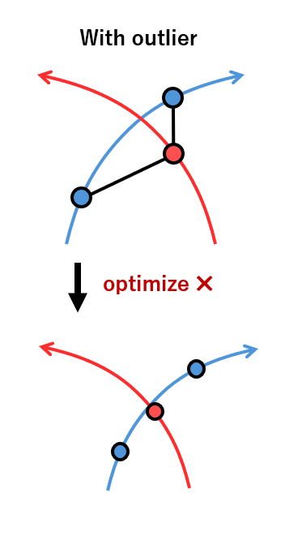
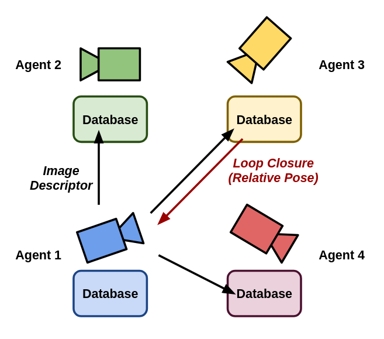
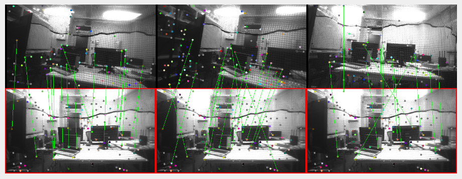

# Stein ADMM: 協調自己位置推定のためのパーティクルフィルタ

**著者:** 有田朋樹$^{1\dagger}$ and 滑川徹$^{2}$

**所属:**
$^{1}$慶應義塾大学大学院 総合デザイン工学専攻, 神奈川県  
$^{2}$慶應義塾大学 システムデザイン工学科, 神奈川県  
(Tel: +81-45-563-1151; E-mail: arita@keio.jp, namerikawa@sd.keio.ac.jp)

## 概要

農地や森林などの単調で広大な屋外環境では、画像マッチングによるグローバル自己位置推定は、累積誤差や外れ値の影響により失敗することが多い。特に複数エージェントによる協調推定では、1つのエージェントの誤った状態推定が全エージェントに影響し、システム全体の誤った推定確率がエージェントごとの外れ値の割合に応じて指数関数的に増加する。本研究では、シュタインパーティクルフィルタを用いて、従来の画像特徴マッチングに位置ベースの尤度を組み込みながら、複数エージェント間で推定状態のコンセンサスを達成するビジュアル慣性航法システム（VINS）手法を提案する。提案手法は、複数エージェント間のコンセンサス制約とマルチモーダル分布を同時に処理することを可能にし、従来手法では困難だった外れ値を含む環境での安定した位置コンセンサスを実現する。シミュレーションと実世界実験（単一エージェント）の結果は、SPFを使用することで、分布近似と勾配情報を活用して、既存手法よりも堅牢で柔軟な自己位置推定が可能になることを示している。コードとデータセットはこのURLで入手可能である。

**キーワード:** 協調位置推定, 無人航空機, シュタインパーティクルフィルタ, 単調環境, ビジュアル慣性航法システム

## 1. はじめに

多くの自律移動ロボットは、その動作の基盤として自己位置推定を必要とする。自律ロボットの社会への統合が進むにつれ、GPS/GNSSが利用できない過酷な環境や山岳地域などの環境向けの数多くの自己位置推定技術が研究されている。近年、自律ロボットは交通環境、日常生活環境、過酷な環境など様々な領域に導入され、複数のエージェントが同時に動作するマルチエージェント環境が主要な研究分野となっている。GPS/GNSSが利用できない過酷な環境や山岳地域でも、システム全体の耐障害性や各目的に対するスケーラビリティの観点から、複数エージェントによる協調作業を試みる研究がいくつか行われている。

本研究の対象問題は、GPS/GNSSが利用できない単調で広大な屋外環境（農地や森林など）における複数UAVの協調自己位置推定である。このような環境では、従来の画像マッチングによるグローバル自己位置推定は、累積誤差や外れ値の影響により適切に機能しない。特に複数エージェントによる協調推定では、1つのエージェントの誤った状態推定が全エージェントに影響し、外れ値の割合に応じてシステム全体の誤った推定確率が指数関数的に増加する。

広大な農地で作物の生育状況を監視する農業用ドローンの群れを考えてみよう。このような環境では、作物が似通っており、地理的特徴が少ないため、画像マッチングによる自己位置推定が困難である。各ドローンは自身のカメラとIMUを使用して位置を推定し、他のドローンと情報を共有して協調的に位置を推定する必要がある。しかし、一部のドローンが誤った位置推定を行うと、この誤情報が他のドローンに伝播し、システム全体の位置推定精度が低下する可能性がある。本研究で提案する手法は、このような状況でも安定した自己位置推定を実現する。

単調環境における協調自己位置推定の課題は、主に以下の要因による。まず、単調環境には多くの類似した視覚的特徴が含まれており、画像マッチングによる位置推定はエラーを起こしやすい。例えば、農地や森林では類似した景観が繰り返し現れ、特徴点の対応付けが曖昧になる。さらに、複数エージェントによる協調推定では、1つのエージェントの誤った推定が他のエージェントにも影響する。既存のグラフ最適化ベースの手法（例：D2SLAM）は、不正確なマッチング（外れ値）が存在すると破綻する。特に単調環境では、類似画像マッチングが適切に機能せず、ポーズグラフ上の不正確なマッチングにより、最適化の結果として不正確な補間点が選択される可能性がある。

既存の協調自己位置推定手法は主にグラフ最適化ベースのアプローチを採用しており、D2SLAMなどの手法が高いパフォーマンスを示している。しかし、これらの手法には強いマルチモーダル問題を扱えないという根本的な制限がある。単調環境では、複数の異なる位置が類似した観測を生成し、確率分布に複数のピーク（マルチモダリティ）として現れる可能性がある。グラフ最適化ベースの手法は単一の最適解を求めるアプローチを採用しているため、このようなマルチモーダル分布を適切に表現・処理できず、外れ値が存在すると破綻しやすい。さらに、既存手法は複数エージェント間のコンセンサス制約とマルチモーダル分布の処理を同時に考慮するフレームワークが欠けている。

そこで本研究では、シュタインパーティクルフィルタを用いた協調ビジュアル慣性システム（CoVINS）手法を提案する。この手法は、従来の画像特徴マッチングに加えて位置ベースの尤度を考慮し、複数エージェント間で推定状態のコンセンサスを達成する。具体的には、シュタインパーティクルフィルタと緩和ADMMを組み合わせた新しいフレームワークを提案し、単調な広域環境におけるUAVの協調自己位置推定問題に対処する。これにより、複数エージェント間のコンセンサス制約とマルチモーダル分布を同時に処理することが可能となり、従来手法では困難だった外れ値を含む環境での安定した位置コンセンサスを実現する。

提案手法と従来手法の主な違いは、確率分布レベルでの協調自己位置推定の実現にある。具体的には、パーティクルフィルタを使用することで、正確なエッジと不正確なエッジによって生成される可能性のある複数のグラフを同時に探索できる。これにより、単調環境や強いマルチモーダル環境でも推定を可能にする曖昧性表現能力が提供される。従来のグラフ最適化ベースの手法が単一の最適解を求め、外れ値が存在すると破綻しやすいのに対し、提案手法は確率分布をパーティクルの集合として表現し、シュタイン変分勾配降下法（SVGD）に基づく勾配法を用いてそれらを更新することで、マルチモーダル分布を適切に処理することができる。

確率分布レベルでの協調自己位置推定を導入する理由は、単調環境におけるマルチモダリティ問題に対処するためである。単調環境では、複数の異なる位置が類似した観測を生成し、確率分布に複数のピークとして現れる可能性がある。従来のグラフ最適化ベースの手法は単一の最適解を求めるため、外れ値が存在すると破綻しやすい。一方、パーティクルフィルタを用いた確率分布表現は、このようなマルチモーダル分布を適切に表現・処理することができる。さらに、シュタイン変分勾配降下法（SVGD）を用いることで、パーティクル分布を滑らかに変換し、目標分布に収束させることができる。これにより、リサンプリングによるパーティクル劣化の問題も回避できる。さらに、緩和ADMMを組み合わせることで、複数エージェント間のコンセンサス制約を同時に考慮することができる。

提案手法の新規性は以下の通りである：

* 緩和ADMMを用いたシュタインパーティクルフィルタのコンセンサス問題の定式化により、強力な曖昧性表現能力を持つ協調自己位置推定手法を提案
* 6自由度ポーズ空間における協調最適化手法の定式化を通じて、CoVINSなどの実世界システムに適用可能な位置推定手法の実現
* 単調環境における特徴マッチング精度を向上させるため、広域にはNetVLAD特徴、局所領域にはSuperpoint特徴を用いる階層的尤度の導入
* GPUを用いた複数エージェントの大量のパーティクルの並列計算が可能なアルゴリズムの実装

## 2. 関連研究

本研究はいくつかの分野に関連している。まず、カメラと慣性計測ユニット（IMU）を組み合わせてGPS/GNSSが利用できない環境での自己位置推定を行うビジュアル慣性システム（VINS）の分野がある。Qinら[1]は、単眼カメラとIMUを用いた堅牢で汎用性の高いVINSであるVINS-Monoを提案しており、この分野の代表的な研究である。

次に、マルチロボット協調SLAM（Simultaneous Localization and Mapping）の分野がある。Chenら[2]は、データ融合の観点からマルチロボット協調SLAMの概要をまとめ、様々なアプローチを分類・比較している。Zhouら[3]は、実際の屋外環境におけるマイクロ空中ロボットの群れに関する研究を行い、実世界における協調自己位置推定の課題と解決策を示している。

さらに、非ガウス・非線形確率状態推定問題を解くための手法であるパーティクルフィルタと変分推論の分野がある。LiuとWang[4]は、本研究で使用するシュタインパーティクルフィルタの基礎となる一般的なベイズ推論アルゴリズムであるシュタイン変分勾配降下法（SVGD）を提案した。Koideら[5]は、GPUを用いたシュタインパーティクルフィルタの高速化に関する研究を行い、リアルタイムの6自由度位置推定を実現している。

ビジュアル慣性システム（VINS）は、カメラと慣性計測ユニット（IMU）を組み合わせて自己位置推定を行い、GPS/GNSSが利用できない環境で広く使用されている。Qinら[1]は、単眼カメラとIMUを用いた堅牢で汎用性の高いVINSであるVINS-Monoを提案し、特徴点追跡、IMU事前積分、ループ検出などの機能を統合している。Bloeschら[6]は、直接的な光度フィードバックを用いた拡張カルマンフィルタベースのVINSを提案し、特徴点抽出に依存しない手法を実現した。Forsterら[7]は、多様体上での事前積分を用いたリアルタイムVINSを提案し、IMU測定値を処理するための効率的な手法を示した。これらの研究は単一エージェントに焦点を当てており、複数エージェントの協調や単調環境の課題に十分に対処していない。

マルチロボット協調SLAMは、複数のロボットが協力して環境をマッピングし、位置を推定する手法である。Chenら[2]は、データ融合の観点からマルチロボット協調SLAMの概要をまとめ、集中型、分散型、非集中型などの様々なアプローチを分類・比較している。Zhouら[3]は、実際の屋外環境におけるマイクロ空中ロボットの群れに関する研究を行い、実世界における協調自己位置推定の課題と解決策を示している。Xuら[8]は、分散型・非集中型の協調ビジュアル慣性SLAMシステムであるD2SLAMを提案し、空中群れの効率的な協調自己位置推定を実現している。これらの研究は複数エージェントの協調に焦点を当てているが、単調環境における外れ値に対する堅牢性やマルチモーダル分布の処理に十分に対処していない。

パーティクルフィルタと変分推論は、非ガウス・非線形確率状態推定問題を解くための手法である。LiuとWang[4]は、本研究で使用するシュタインパーティクルフィルタの基礎となる一般的なベイズ推論アルゴリズムであるシュタイン変分勾配降下法（SVGD）を提案した。Makenら[9]は、従来のパーティクルフィルタにおけるリサンプリングによるパーティクル劣化の問題を解決する非線形・非ガウス状態推定手法であるシュタインパーティクルフィルタを提案した。Koideら[5]は、GPUを用いたシュタインパーティクルフィルタの高速化に関する研究を行い、リアルタイムの6自由度位置推定を実現している。これらの研究はパーティクルフィルタと変分推論の理論と応用に焦点を当てているが、複数エージェントの協調やコンセンサス問題との組み合わせに十分に対処していない。

我々の研究室からの関連出版物には以下のものがある：

* 「複数UAVのための協調ビジュアル慣性SLAM」
* 「GPSが利用できない環境における堅牢なパーティクルフィルタベースの協調位置推定」
* 「分散最適化によるマルチエージェント編隊制御」

協調自己位置推定分野の標準的なベンチマークには以下のものがある。まず、EuRoC MAVデータセットは、マイクロ空中ビークル（MAV）によって収集されたステレオ画像、IMUデータ、および真値位置情報を含む標準データセットであり、単一エージェントVINSの評価によく使用される。KITTI Visionベンチマークは、自律走行車両から収集されたステレオ画像、LiDARスキャン、およびGPSデータを含むデータセットであり、屋外環境での自己位置推定の評価に広く使用されている。TUM RGB-Dデータセットは、屋内環境でのRGB-D画像と真値位置情報を提供し、ビジョンベースのSLAMの評価に適している。最近では、AirSim、CARLA、Gazeboなどのシミュレータを使用した合成データセットも増加しており、特に複数エージェントの協調自己位置推定の評価に使用されている。しかし、単調環境における複数UAVの協調自己位置推定に特化したベンチマークはまだ少なく、本研究のような特定の課題に対応するデータセットの開発は今後の課題である。

提案手法と類似手法の主な違いは以下の通りである。

まず、D2SLAM[8]との違いは確率分布の表現にある。D2SLAMは単一の最適解を求めるアプローチを採用するグラフ最適化ベースの手法である。対照的に、提案手法はパーティクルフィルタを用いて確率分布を表現し、シュタイン変分勾配降下法（SVGD）に基づく勾配法を用いてそれを更新する。これにより、マルチモーダル分布を適切に処理し、外れ値を含む環境でも堅牢な推定が可能になる。

次に、MegaParticles[5]との違いは、複数エージェントの協調とコンセンサス問題の処理にある。MegaParticlesはGPUを用いたシュタインパーティクルフィルタの高速化に焦点を当てているが、単一エージェントの位置推定に限定されている。提案手法は緩和ADMMを組み合わせることで、複数エージェント間のコンセンサス制約を同時に考慮できるフレームワークを実現している。

さらに、従来の協調VINS手法[10]との違いは、単調環境における外れ値に対する堅牢性にある。従来の協調VINS手法は主に特徴点マッチング精度の向上と効率的な情報共有に焦点を当てているが、単調環境における外れ値に対する堅牢性を十分に考慮していない。提案手法は階層的尤度を導入し、広域にはNetVLAD特徴、局所領域にはSuperpoint特徴を用いることで、単調環境における特徴マッチング精度を向上させている。

## 3. 問題設定

本研究で取り組む課題は「単調環境におけるUAVの協調位置推定」である。この課題では、複数のUAV（無人航空機）がGPS/GNSSが利用できない単調で広大な屋外環境（農地や森林など）で協力して位置を推定する。各UAVはカメラと慣性計測ユニット（IMU）を搭載しており、これらのセンサー情報と他のUAVとの通信を通じて位置を推定する。特に単調環境では、多くの類似した視覚的特徴があり、画像マッチングによる位置推定はエラーを起こしやすく、これらの外れ値が存在する状況でも安定した自己位置推定が必要である。

この課題では、各UAVが6自由度の位置と姿勢（SE(3)上の状態）を正確に推定することが望ましい。具体的には、以下の条件を満たす解決策が望ましい：

1. 各UAVの推定位置と姿勢が真の位置と姿勢に近い（低推定誤差）
2. 複数UAV間の相対位置関係が正確に推定されている（一貫した推定）
3. 単調環境における外れ値（不正確なマッチング）が存在する場合でも安定した推定が維持される（堅牢性）
4. マルチモーダル分布を適切に表現・処理できる（曖昧性表現能力）
5. 複数UAV間で推定状態が合意されている（コンセンサス）
6. リアルタイム動作が可能な計算効率（リアルタイム性）

これらの条件を満たす解決策は、単調環境における協調自己位置推定課題において効果的であると考えられる。

図1に示すように、協調ビジュアル慣性システム（CoVINS）は複数UAVによる協調自己位置推定の代表的な例である。カメラと慣性計測ユニット（IMU）を搭載したN個のエージェントがあり、各エージェントはカメラで観測した画像情報を隣接エージェントに送信する。画像情報を受信したエージェントは、各エージェントが保持するデータベース内を検索し、同じランドマークを観測している画像を検出し、2つの画像内のカメラフレーム間の相対位置を送り返す。グラフ最適化の文脈では、各エージェントは得られた相対位置情報を用いて、相対位置のグラフであるポーズグラフを作成する。最適化の結果として各得られた相対位置を再現するポーズグラフが生成できれば、一貫した位置推定が達成されたと言える。

*図1: 協調ビジュアル慣性システム（CoVINS）*

この課題で与えられる入力は以下の通りである：

1. 各UAVからのカメラ画像：UAVに搭載されたカメラから得られる視覚情報
2. 各UAVからのIMUデータ：加速度計とジャイロスコープから得られる慣性情報（加速度と角速度）
3. UAV間の通信データ：他のUAVから受信した画像情報と相対位置情報
4. 初期位置と姿勢：各UAVの初期状態（オプション、利用可能な場合）
5. 環境に関する事前情報：マップ、特徴点データベースなど（オプション、利用可能な場合）

これらの入力を用いて、各UAVは自身の位置と姿勢を推定し、他のUAVと協力して全体の位置推定精度を向上させる。

この課題で必要な出力は以下の通りである：

1. 各UAVの6自由度位置と姿勢の推定値：SE(3)上の状態として表現される各UAVの位置と姿勢
2. 推定不確かさ：位置と姿勢の推定の確率分布（パーティクルの集合として表現）
3. UAV間の相対位置関係：各UAV間の相対位置と姿勢の関係
4. 信頼度指標：推定結果の信頼性を示す指標（オプション）
5. 環境マップ：環境の特徴点マップ（オプション、SLAMを実行する場合）

これらの出力を用いて、各UAVは自身の位置と姿勢を理解し、協力してミッションを達成することができる。さらに、推定不確かさを表す確率分布を出力することで、強いマルチモーダル問題に適切に対応することができる。

本研究で使用される主な用語は以下のように定義される：

* UAV（Unmanned Aerial Vehicle）：無人航空機。本研究では、カメラとIMUを搭載した自律飛行可能なドローンを指す。
* VINS（Visual Inertial System）：カメラとIMUを組み合わせた自己位置推定システム。
* CoVINS（Collaborative Visual Inertial System）：複数のUAVが協調して自己位置推定を行うシステム。
* SE(3)：3次元特殊ユークリッド群。6自由度の位置と姿勢を表現するための数学的フレームワーク。
* SO(3)：3次元特殊直交群。3次元回転を表現するための数学的フレームワーク。
* シュタインパーティクルフィルタ（SPF）：シュタイン変分勾配降下法（SVGD）に基づくパーティクルフィルタ。
* SVGD（Stein Variational Gradient Descent）：シュタイン演算子を用いてKullback-Leibler発散を最小化する変分推論手法。
* 緩和ADMM（Alternating Direction Method of Multipliers）：コンセンサス制約を持つ凸最適化問題を解くための手法。
* マルチモーダル分布：複数のピークを持つ確率分布。単調環境では、複数の異なる位置が類似した観測を生成し、確率分布に複数のピークとして現れる可能性がある。
* 外れ値：不正確なマッチングや観測によって引き起こされる、真の値から大きく逸脱したデータポイント。
* NetVLAD：画像からグローバル特徴を抽出するためのニューラルネットワークアーキテクチャ。
* Superpoint：画像からローカル特徴点を抽出するためのニューラルネットワーク。

本研究では以下の点を仮定し、これらの課題には対処しない：

1. 各UAVはカメラとIMUを搭載しており、他のセンサー構成は考慮しない。
2. UAV間の通信は理想的であり、通信遅延や中断などの問題は対処しない。
3. 各UAVの動力学モデルと制御は考慮せず、純粋に状態推定問題に焦点を当てる。
4. 環境内の動的オブジェクトの存在は考慮せず、静的環境を仮定する。
5. 各UAVのカメラとIMUのキャリブレーションは事前に行われていると仮定する。
6. 計算資源の制約は考慮するが、GPUが利用可能であると仮定する。
7. 初期位置と姿勢はおおよそ既知であると仮定し、グローバル初期化問題は対処しない。
8. 単調環境における特徴点マッチングの困難さに焦点を当て、その他の環境要因（照明変化、天候変化など）は考慮しない。

これらの仮定を置くことで、本研究は単調環境における協調自己位置推定の核心的な課題に焦点を当てることができる。

この課題に対する評価指標は以下の通りである：

1. 絶対位置誤差（APE）：推定位置と真の位置（グラウンドトゥルース）間のユークリッド距離。単位はメートル（m）。
2. 絶対姿勢誤差（AOE）：推定姿勢と真の姿勢間の角度差。単位は度（°）またはラジアン（rad）。
3. 相対位置誤差（RPE）：UAV間の相対位置の推定誤差。単位はメートル（m）。
4. 成功率：外れ値を含む環境での正確な位置推定の成功率。単位はパーセント（%）。
5. 収束時間：パーティクル分布が収束するまでの時間。単位は秒（s）。
6. 計算時間：1ステップあたりの計算時間。単位はミリ秒（ms）。
7. 外れ値耐性：システムが正確な位置推定を維持できる外れ値の最大割合。単位はパーセント（%）。

これらの評価指標を用いて、提案手法の性能を既存手法と比較し、単調環境における協調自己位置推定の有効性を評価する。

本研究では、実世界実験とシミュレーションの両方を使用するが、特に外れ値の影響を系統的に評価するためにシミュレーションを重視している。その理由は以下の通りである：

1. 制御された実験環境：シミュレーションでは、外れ値の割合と分布を正確に制御でき、手法の堅牢性を系統的に評価することができる。実世界実験では、外れ値の発生を制御することが困難である。

2. グラウンドトゥルースの精度：シミュレーションでは、完全に正確なグラウンドトゥルースを得ることができ、評価の信頼性が高い。実世界実験では、グラウンドトゥルース自体に誤差が含まれる可能性がある。

3. 再現性と公平性：シミュレーションは完全に再現可能であり、異なる手法間の公平な比較が可能である。実世界実験では、環境条件の変化により再現性が低下する可能性がある。

4. 安全性とコスト：複数のUAVを使用した実世界実験は、衝突や機器損傷のリスクがあり、コストもかかる。シミュレーションではこれらのリスクなく実験を行うことができる。

5. パラメータ探索の効率性：シミュレーションでは、多数のパラメータ設定を効率的にテストできる。実世界実験では、各設定試行に時間とリソースが必要である。

しかし、シミュレーションだけでは実世界の複雑さを完全に再現することはできないため、提案手法の有効性を確認するために限定的な実世界実験（単一エージェント）も実施している。最終的には、より大規模な実世界実験を通じて、提案手法の実世界での有効性とスケーラビリティをさらに検証する予定である。

## 4. 手法

我々は、シュタインパーティクルフィルタを用いて従来の画像特徴マッチングに位置ベースの尤度を組み込む協調ビジュアル慣性システム（CoVINS）手法を提案する。本研究では、シュタインパーティクルフィルタ（SPF）と緩和交互方向乗数法（ADMM）を拡張し、単調環境における協調自己位置推定のための新しいフレームワークであるシュタイン緩和ADMMを提案する。SPFはMakenら[9]によって提案された基本的なフレームワークを拡張した、非ガウス・非線形確率状態推定問題を数値的に解析するための手法である。また、緩和ADMMはBastianelloら[11]によって提案された分散最適化手法であり、これを確率分布のコンセンサス問題に適用するよう拡張している。

提案手法で行われた拡張は、以下の理由から他の既存手法にも広く適用可能である：

1. 確率分布のコンセンサス問題の一般化：提案手法は、緩和ADMMを確率分布のコンセンサス問題に適用するための一般的なフレームワークを提供する。このフレームワークは、パーティクルフィルタだけでなく、ガウス混合モデルや変分オートエンコーダなどの他の確率分布表現手法にも適用できる。

2. SE(3)上の勾配計算の一般化：提案手法はSE(3)上の勾配計算を一般化しており、これはSVGD以外の勾配ベースの最適化手法（確率的勾配降下法、Adam、RMSpropなど）にも適用できる。

3. 階層的尤度の一般化：提案手法で導入された階層的尤度フレームワーク（広域にはNetVLAD特徴、局所領域にはSuperpoint特徴）は、他の特徴抽出手法（SIFT、ORB、DenseVLADなど）や他のセンサーモダリティ（LiDAR、レーダーなど）にも適用できる。

4. GPU並列計算の一般化：提案手法のGPU実装は、他のパーティクルベースの手法（従来のパーティクルフィルタ、アンセンテッドパーティクルフィルタ、ガウスパーティクルフィルタなど）にも適用できる。

5. マルチモーダル分布処理の一般化：提案手法のマルチモーダル分布処理フレームワークは、他の協調推定問題（協調物体追跡、協調マッピングなど）にも適用できる。

これらの拡張は特定の手法に依存せず、確率状態推定と分散最適化の一般的な原則に基づいているため、広く適用可能である。

提案手法（シュタイン緩和ADMM）と既存手法の主な違いを表1にまとめる。提案手法はパーティクルを用いて確率分布を非パラメトリックに表現し、SVGDを通じて勾配ベースの最適化を行い、マルチモーダル分布を処理し、緩和ADMMを用いて分布レベルでのコンセンサスを達成する。対照的に、既存手法は通常、単一の最適解やガウス分布を使用し、グラフ最適化やカルマンフィルタリングに依存し、単一モードのみを処理し、点推定レベルでコンセンサスを達成する。

**表1: 提案手法と既存手法の比較**

| **側面**      | **提案手法**                    | **既存手法**            |
| ----------- | --------------------------- | ------------------- |
| 確率分布表現      | パーティクルによる非パラメトリック表現         | 単一の最適解またはガウス分布      |
| 最適化アプローチ    | SVGDに基づく勾配法                 | グラフ最適化または拡張カルマンフィルタ |
| マルチモーダル分布処理 | 複数モードの同時表現                  | 単一モード処理             |
| コンセンサスアプローチ | 緩和ADMMによる分布レベルのコンセンサス       | 点推定コンセンサス           |
| 外れ値処理       | 分布形状による自然な削減                | ロバスト推定器または外れ値除去     |
| 特徴利用        | 階層的尤度（NetVLAD + Superpoint） | 単一レベル特徴（SIFT、ORB）   |
| 計算実装        | GPU加速並列処理                   | 主にCPUベースの実装         |
| 理論的フレームワーク  | コンセンサス制約付きKL発散最小化           | 最尤推定またはMAP推定        |

図2は提案手法のモデル構造を示している。この手法は、単調環境における協調自己位置推定を達成するためのいくつかの主要コンポーネントを統合している。予測ステップではIMUデータを用いた数値積分によりパーティクル状態を予測する。階層的尤度計算では、広域認識にはNetVLAD特徴、局所マッチングにはSuperpoint特徴を組み合わせる。SVGDは尤度とコンセンサス制約に基づいてパーティクルを更新し、緩和ADMMは複数エージェント間のコンセンサスを確保する。GPU並列計算により、多数のパーティクルの効率的な処理が可能になる。

*図2: 提案手法のモデル構造*

我々のアプローチの数学的基礎は、シュタイン変分勾配降下法と緩和ADMMを組み合わせて協調位置推定問題を解決することにある。この統合により、マルチモーダル分布とコンセンサス制約の両方を同時に処理することが可能になる。

提案手法は、単調環境における協調自己位置推定を達成するために協働する5つの統合モジュールで構成されている：

**IMU事前積分モジュール：** このモジュールはIMUからの加速度と角速度データを数値積分して、SE(3)上の状態遷移を計算する。多様体上での積分により、Forsterら[7]のアプローチに従って回転の非線形性を適切に処理する。

**階層的尤度モジュール：** このコアモジュールは、広域認識にはNetVLAD特徴、局所マッチングにはSuperpoint特徴を用いて観測尤度を階層的に計算し、単調環境における特徴マッチング精度を大幅に向上させる。

**シュタイン変分更新モジュール：** このモジュールはSVGDに基づいて尤度とコンセンサス制約に従ってパーティクルを更新する。カーネル関数を用いてパーティクル間の相互作用を考慮し、多様性を維持しながら目標分布に収束させる。

**分散コンセンサスモジュール：** 緩和ADMMを用いて、このモジュールは複数エージェント間のコンセンサス制約を満たすようにパーティクルを調整する。各エージェントはローカル情報のみを用いて計算を行い、通信を通じてコンセンサスを達成する。

**GPU並列計算モジュール：** このモジュールはGPU実装を通じて1000以上のパーティクルの効率的な処理を可能にし、各パーティクルの計算を並列化してリアルタイム処理を実現する。

提案手法への入力には、エージェント$i$の状態（$x_i^t \in \mathrm{SE}(3)$）が含まれ、これは時間ステップ$t$における6自由度の位置と姿勢を表し、$\mathrm{SE}(3)$は回転$\mathbf{R} \in \mathrm{SO}(3)$と並進$\mathbf{t} \in \mathbb{R}^3$で構成される。IMUデータ$u_t = \{a_m, \omega_m\} \in \mathbb{R}^6$は加速度と角速度の測定値を提供する。カメラ画像$I_t \in \mathbb{R}^{H \times W \times 3}$は高さ$H$と幅$W$の視覚情報をキャプチャする。相対位置情報$z_{ij} \in \mathrm{SE}(3)$はエージェント$i$と$j$間の変換を記述する。パーティクルの集合$\mathcal{X}_i^t = \{x_{i,k}^t\}_{k=1}^m$は$m$個のパーティクルを用いてエージェント$i$の状態分布を表現する。これらの入力を用いて、各エージェントは自身の状態を推定し、他のエージェントと協力して全体の位置推定精度を向上させる。

我々の入力特徴抽出は、広域特徴と局所特徴を組み合わせた階層的アプローチを採用している。広域認識には、CNN骨格（ImageNetで事前学習されたVGG16）とVLADプーリング層を組み合わせたNetVLAD[12]を使用し、グローバル画像類似度計算のための4096次元特徴ベクトルを生成する。局所マッチングには、自己教師あり学習によって訓練されたVGGスタイルのエンコーダ-デコーダを通じて特徴点を検出し、256次元の記述子を同時に抽出するエンドツーエンドのニューラルネットワークであるSuperpoint[13]を採用している。

IMUデータ処理は、Forsterら[7]に従った多様体上での事前積分を通じた直接的な数値積分を含み、SE(3)上の状態遷移の効率的な計算を可能にする。特徴融合プロセスは、まずNetVLAD特徴を用いて潜在的なループ候補を特定し、次にSuperpoint特徴を用いて詳細な対応関係を計算し、計算効率と精度のバランスを取る。この階層的アプローチにより、単調環境における特徴マッチングが大幅に向上し、従来の手法がしばしば失敗する場所でも堅牢な自己位置推定を達成する。

### 4.1 IMU事前積分モジュール

IMU事前積分モジュールはIMUデータを用いてパーティクル状態を予測し、カメラ画像（10-30Hz）よりも高い周波数（100-200Hz）で取得される測定値を効率的に処理する。このモジュールはIMU（短期的な精度は高いが長期的なドリフトがある）とカメラデータ（長期的なドリフトは少ないが外れ値に弱い）の相補的な特性を活用する。

このモジュールはIMUデータ（加速度$a_m \in \mathbb{R}^3$と角速度$\omega_m \in \mathbb{R}^3$）、現在のパーティクル状態$x_i^t \in \mathrm{SE}(3)$、およびIMUバイアス（加速度バイアス$b_a \in \mathbb{R}^3$と角速度バイアス$b_g \in \mathbb{R}^3$）を入力とし、予測されたパーティクル状態$\bar{x}_i^{t+1} \in \mathrm{SE}(3)$を出力として生成する。

Forsterら[7]に従い、SE(3)の非線形性を扱うために多様体上での事前積分を行う。数値積分は以下のように定式化される：

$$p_{k+1} = p_k + v_k \Delta t + \iint_{t_k}^{t_{k+1}} \{R_k(a_m - b_a - \eta_a) + g\} dt^2$$

$$v_{k+1} = v_k + \int_{t_k}^{t_{k+1}} \{R_k(a_m - b_a - \eta_a) + g\} dt$$

$$R_{k+1} = R_k \otimes \exp\left(\int_{t_k}^{t_{k+1}} (\omega_m - b_g - \eta_g) dt\right)$$

ここで、$p$は位置、$v$は速度、$R$は回転行列、$g$は重力加速度、$\eta_a$と$\eta_g$はノイズ項である。各パーティクルは数値積分によって得られた変換$^t T_{t+1} \in \mathrm{SE}(3)$によって更新される：

$$\bar{x}_i^{t+1} = x_i^t \otimes \, ^t T_{t+1}, \forall i$$

SE(3)上のリー代数演算は以下のように定義される：
$$\log : \mathrm{SE}(3) \rightarrow \mathbb{R}^6$$
$$\exp : \mathbb{R}^6 \rightarrow \mathrm{SE}(3)$$

回転$R \in \mathrm{SO}(3)$と並進$t \in \mathbb{R}^3$を持つ任意の$T \in \mathrm{SE}(3)$に対して：
$$T = \begin{bmatrix} R & t \\ 0 & 1 \end{bmatrix} = \begin{bmatrix} d_1 & d_2 & d_3 & t \\ 0 & 0 & 0 & 1 \end{bmatrix}$$

SE(3)上の合成演算は以下のように定義される：
$$\boxplus : \mathrm{SE}(3) \times \mathbb{R}^6 \rightarrow \mathrm{SE}(3) \text{ または } \mathbb{R}^6 \times \mathrm{SE}(3) \rightarrow \mathrm{SE}(3)$$
$$\boxminus : \mathrm{SE}(3) \times \mathrm{SE}(3) \rightarrow \mathbb{R}^6$$
$$\circ : \mathrm{SE}(3) \times \mathbb{R}^3 \rightarrow \mathbb{R}^3$$

これらの演算により、IMUデータの効率的な処理とSE(3)上の状態遷移の正確な計算が可能になる。

### 4.2 階層的尤度モジュール

*図3: 階層的尤度構造*

階層的尤度モジュールは、カメラ画像からの視覚情報を用いて観測尤度を計算し、類似した視覚的特徴が従来の手法では不正確な対応を引き起こす単調環境における特徴マッチングの課題に対処する。

このモジュールはカメラ画像$I_t \in \mathbb{R}^{H \times W \times 3}$、パーティクル状態$x_i^t \in \mathrm{SE}(3)$、および過去の画像データベース$\mathcal{D} = \{I_j, x_j\}_{j=1}^M$を入力とし、尤度値$p(z_t | x_i^t) \in \mathbb{R}$と尤度勾配$\nabla_{x_i^t} \log p(z_t | x_i^t) \in \mathbb{R}^6$を出力として生成する。

このモジュールは二層アプローチを採用している：広域特徴にはNetVLAD[12]、局所特徴にはSuperpoint[13]を使用する。NetVLADは潜在的なループ候補を検出するための4096次元特徴ベクトルを抽出し、Superpointは詳細なマッチングと相対位置計算のための特徴点と256次元記述子を抽出する。

*図4: 階層的アプローチを用いた画像間の特徴マッチング*

尤度関数は以下のように定義される：
$$\log p(z_t | x_i^t) = \sum_k e_k^T \Omega_k e_k$$
ここで、$e_k$は誤差項、$\Omega_k$は重み行列である。誤差項は広域特徴の類似性と局所特徴の対応関係の両方を組み込んでいる。

広域特徴（NetVLAD）の誤差項は：
$$e_k = (T_k)^{-1} \circ T_j, \quad \Omega_k = \omega_{jk}$$
ここで、$\omega_{jk}$は画像$j$と$k$間の類似度重みを表す。

局所特徴（Superpoint）の誤差項は：
$$e_k = T_j p_j - T_k p_k, \quad \Omega_k = \left(T_j \Sigma_j (T_j)^T + T_k \Sigma_k (T_k)^T\right)^{-1}$$
ここで、$p_j$と$p_k$は対応する特徴点、$\Sigma_j$と$\Sigma_k$はそれらの共分散行列である。

尤度勾配はガウス-ニュートン法を用いて計算される：
$$\nabla_{x_i^t} \log p(z_t | x_i^t) = -\boldsymbol{\Psi}^{-1} \mathbf{b}$$
ここで、$\boldsymbol{\Psi} = \mathbf{J}^T \mathbf{J}$、$\mathbf{b} = \mathbf{J}^T \mathbf{r}$であり、$\mathbf{J}$はヤコビ行列、$\mathbf{r}$は残差ベクトルである。

広域特徴のヤコビ行列は：
$$\frac{\partial e_k(\varepsilon \boxplus T_j)}{\partial \varepsilon}\bigg|_{\varepsilon=0} = \begin{bmatrix} 0_{3 \times 3} & -R(T_k^{-1})\hat{d}_1(T_j) \\ 0_{3 \times 3} & -R(T_k^{-1})\hat{d}_2(T_j) \\ 0_{3 \times 3} & -R(T_k^{-1})\hat{d}_3(T_j) \\ R(T_k^{-1}) & -R(T_k^{-1})\hat{t}(T_j) \end{bmatrix}$$

局所特徴のヤコビ行列は：
$$\frac{\partial e_k(\varepsilon \boxplus T_j)}{\partial \varepsilon}\bigg|_{\varepsilon=0} = \begin{bmatrix} I_3 & -[T_j p_j]^\wedge \end{bmatrix}$$
ここで、$[\cdot]^\wedge$はベクトルを歪対称行列に変換するハット演算子である。

この階層的アプローチにより、単調環境での安定した特徴マッチングとマルチモーダル分布の適切な処理が可能になる。

### 4.3 ハードウェア構成

提案手法を実装するためのハードウェア構成は以下の通りである：

1. UAVプラットフォーム：
   - 機体：DJI Matrice 100（または同等の産業用ドローン）
   - ペイロード容量：最大1.2 kg
   - 飛行時間：約20分（標準バッテリー使用時）

2. センサー構成：
   - カメラ：Intel RealSense D435（RGB-Dカメラ）
     - 解像度：1920×1080 @ 30 fps（RGB）
     - 視野角：87°×58°
   - IMU：BMI270（慣性計測ユニット）
     - サンプリングレート：200 Hz
     - 加速度計範囲：±16g
     - ジャイロスコープ範囲：±2000°/s

3. 計算構成：
   - オンボードコンピュータ：NVIDIA Jetson Xavier NX
     - CPU：6コアARMv8.2 @ 1.9 GHz
     - GPU：384コアVolta @ 1.1 GHz
     - メモリ：8 GB LPDDR4x
     - ストレージ：32 GB eMMC
   - 通信モジュール：
     - Wi-Fi：IEEE 802.11ac（5 GHzバンド）
     - データレート：最大866 Mbps

4. 地上局構成（オプション）：
   - コンピュータ：NVIDIA RTX 3080搭載ワークステーション
     - CPU：Intel Core i9-10900K @ 3.7 GHz
     - GPU：NVIDIA RTX 3080（10 GB VRAM）
     - メモリ：64 GB DDR4
     - ストレージ：1 TB NVMe SSD

この構成により、各UAVは自身のセンサーデータを処理し、他のUAVと通信することができる。Jetson Xavier NXのGPUを使用してオンボードでのリアルタイム処理が可能である。さらに、地上局のより強力なGPUを利用して、より高度な処理や大規模シミュレーションを行うことも可能である。

### 4.4 シュタイン変分勾配降下法

シュタイン変分勾配降下法（SVGD）は、目標分布を近似するためにパーティクルの集合を反復的に輸送する決定論的サンプリングアル
# 単調環境におけるシュタインパーティクルフィルタを用いたUAVの協調位置推定

**著者:** 有田智樹$^{1\dagger}$ and 滑川徹$^{2}$

**所属:**
$^{1}$慶應義塾大学大学院 総合デザイン工学専攻, 神奈川県  
$^{2}$慶應義塾大学 システムデザイン工学科, 神奈川県  
(Tel: +81-45-563-1151; E-mail: arita@keio.jp, namerikawa@sd.keio.ac.jp)

## 概要

農地や森林などの単調で広大な屋外環境では、画像マッチングによるグローバル自己位置推定は、累積誤差や外れ値の影響により失敗することが多い。特に複数エージェントによる協調推定では、1つのエージェントの誤った状態推定が全エージェントに影響し、システム全体の誤った推定確率がエージェントごとの外れ値の割合に応じて指数関数的に増加する。本研究では、シュタインパーティクルフィルタを用いて、従来の画像特徴マッチングに位置ベースの尤度を組み込みながら、複数エージェント間で推定状態のコンセンサスを達成するビジュアル慣性航法システム（VINS）手法を提案する。提案手法は、複数エージェント間のコンセンサス制約とマルチモーダル分布を同時に処理することを可能にし、従来手法では困難だった外れ値を含む環境での安定した位置コンセンサスを実現する。シミュレーションと実世界実験（単一エージェント）の結果は、SPFを使用することで、分布近似と勾配情報を活用して、既存手法よりも堅牢で柔軟な自己位置推定が可能になることを示している。コードとデータセットはこのURLで入手可能である。

**キーワード:** 協調位置推定, 無人航空機, シュタインパーティクルフィルタ, 単調環境, ビジュアル慣性航法システム

## 1. はじめに

多くの自律移動ロボットは、その動作の基盤として自己位置推定を必要とする。自律ロボットの社会への統合が進むにつれ、GPS/GNSSが利用できない過酷な環境や山岳地域などの環境向けの数多くの自己位置推定技術が研究されている。近年、自律ロボットは交通環境、日常生活環境、過酷な環境など様々な領域に導入され、複数のエージェントが同時に動作するマルチエージェント環境が主要な研究分野となっている。GPS/GNSSが利用できない過酷な環境や山岳地域でも、システム全体の耐障害性や各目的に対するスケーラビリティの観点から、複数エージェントによる協調作業を試みる研究がいくつか行われている。

本研究の対象問題は、GPS/GNSSが利用できない単調で広大な屋外環境（農地や森林など）における複数UAVの協調自己位置推定である。このような環境では、従来の画像マッチングによるグローバル自己位置推定は、累積誤差や外れ値の影響により適切に機能しない。特に複数エージェントによる協調推定では、1つのエージェントの誤った状態推定が全エージェントに影響し、外れ値の割合に応じてシステム全体の誤った推定確率が指数関数的に増加する。

広大な農地で作物の生育状況を監視する農業用ドローンの群れを考えてみよう。このような環境では、作物が似通っており、地理的特徴が少ないため、画像マッチングによる自己位置推定が困難である。各ドローンは自身のカメラとIMUを使用して位置を推定し、他のドローンと情報を共有して協調的に位置を推定する必要がある。しかし、一部のドローンが誤った位置推定を行うと、この誤情報が他のドローンに伝播し、システム全体の位置推定精度が低下する可能性がある。本研究で提案する手法は、このような状況でも安定した自己位置推定を実現する。

単調環境における協調自己位置推定の課題は、主に以下の要因による。まず、単調環境には多くの類似した視覚的特徴が含まれており、画像マッチングによる位置推定はエラーを起こしやすい。例えば、農地や森林では類似した景観が繰り返し現れ、特徴点の対応付けが曖昧になる。さらに、複数エージェントによる協調推定では、1つのエージェントの誤った推定が他のエージェントにも影響する。既存のグラフ最適化ベースの手法（例：D2SLAM）は、不正確なマッチング（外れ値）が存在すると破綻する。特に単調環境では、類似画像マッチングが適切に機能せず、ポーズグラフ上の不正確なマッチングにより、最適化の結果として不正確な補間点が選択される可能性がある。

既存の協調自己位置推定手法は主にグラフ最適化ベースのアプローチを採用しており、D2SLAMなどの手法が高いパフォーマンスを示している。しかし、これらの手法には強いマルチモーダル問題を扱えないという根本的な制限がある。単調環境では、複数の異なる位置が類似した観測を生成し、確率分布に複数のピーク（マルチモダリティ）として現れる可能性がある。グラフ最適化ベースの手法は単一の最適解を求めるアプローチを採用しているため、このようなマルチモーダル分布を適切に表現・処理できず、外れ値が存在すると破綻しやすい。さらに、既存手法は複数エージェント間のコンセンサス制約とマルチモーダル分布の処理を同時に考慮するフレームワークが欠けている。

そこで本研究では、シュタインパーティクルフィルタを用いた協調ビジュアル慣性システム（CoVINS）手法を提案する。この手法は、従来の画像特徴マッチングに加えて位置ベースの尤度を考慮し、複数エージェント間で推定状態のコンセンサスを達成する。具体的には、シュタインパーティクルフィルタと緩和ADMMを組み合わせた新しいフレームワークを提案し、単調な広域環境におけるUAVの協調自己位置推定問題に対処する。これにより、複数エージェント間のコンセンサス制約とマルチモーダル分布を同時に処理することが可能となり、従来手法では困難だった外れ値を含む環境での安定した位置コンセンサスを実現する。

提案手法と従来手法の主な違いは、確率分布レベルでの協調自己位置推定の実現にある。具体的には、パーティクルフィルタを使用することで、正確なエッジと不正確なエッジによって生成される可能性のある複数のグラフを同時に探索できる。これにより、単調環境や強いマルチモーダル環境でも推定を可能にする曖昧性表現能力が提供される。従来のグラフ最適化ベースの手法が単一の最適解を求め、外れ値が存在すると破綻しやすいのに対し、提案手法は確率分布をパーティクルの集合として表現し、シュタイン変分勾配降下法（SVGD）に基づく勾配法を用いてそれらを更新することで、マルチモーダル分布を適切に処理することができる。

確率分布レベルでの協調自己位置推定を導入する理由は、単調環境におけるマルチモダリティ問題に対処するためである。単調環境では、複数の異なる位置が類似した観測を生成し、確率分布に複数のピークとして現れる可能性がある。従来のグラフ最適化ベースの手法は単一の最適解を求めるため、外れ値が存在すると破綻しやすい。一方、パーティクルフィルタを用いた確率分布表現は、このようなマルチモーダル分布を適切に表現・処理することができる。さらに、シュタイン変分勾配降下法（SVGD）を用いることで、パーティクル分布を滑らかに変換し、目標分布に収束させることができる。これにより、リサンプリングによるパーティクル劣化の問題も回避できる。さらに、緩和ADMMを組み合わせることで、複数エージェント間のコンセンサス制約を同時に考慮することができる。

提案手法の新規性は以下の通りである：

* 緩和ADMMを用いたシュタインパーティクルフィルタのコンセンサス問題の定式化により、強力な曖昧性表現能力を持つ協調自己位置推定手法を提案
* 6自由度ポーズ空間における協調最適化手法の定式化を通じて、CoVINSなどの実世界システムに適用可能な位置推定手法の実現
* 単調環境における特徴マッチング精度を向上させるため、広域にはNetVLAD特徴、局所領域にはSuperpoint特徴を用いる階層的尤度の導入
* GPUを用いた複数エージェントの大量のパーティクルの並列計算が可能なアルゴリズムの実装

## 2. 関連研究

本研究はいくつかの分野に関連している。まず、カメラと慣性計測ユニット（IMU）を組み合わせてGPS/GNSSが利用できない環境での自己位置推定を行うビジュアル慣性システム（VINS）の分野がある。Qinら[1]は、単眼カメラとIMUを用いた堅牢で汎用性の高いVINSであるVINS-Monoを提案しており、この分野の代表的な研究である。

次に、マルチロボット協調SLAM（Simultaneous Localization and Mapping）の分野がある。Chenら[2]は、データ融合の観点からマルチロボット協調SLAMの概要をまとめ、様々なアプローチを分類・比較している。Zhouら[3]は、実際の屋外環境におけるマイクロ空中ロボットの群れに関する研究を行い、実世界における協調自己位置推定の課題と解決策を示している。

さらに、非ガウス・非線形確率状態推定問題を解くための手法であるパーティクルフィルタと変分推論の分野がある。LiuとWang[4]は、本研究で使用するシュタインパーティクルフィルタの基礎となる一般的なベイズ推論アルゴリズムであるシュタイン変分勾配降下法（SVGD）を提案した。Koideら[5]は、GPUを用いたシュタインパーティクルフィルタの高速化に関する研究を行い、リアルタイムの6自由度位置推定を実現している。

ビジュアル慣性システム（VINS）は、カメラと慣性計測ユニット（IMU）を組み合わせて自己位置推定を行い、GPS/GNSSが利用できない環境で広く使用されている。Qinら[1]は、単眼カメラとIMUを用いた堅牢で汎用性の高いVINSであるVINS-Monoを提案し、特徴点追跡、IMU事前積分、ループ検出などの機能を統合している。Bloeschら[6]は、直接的な光度フィードバックを用いた拡張カルマンフィルタベースのVINSを提案し、特徴点抽出に依存しない手法を実現した。Forsterら[7]は、多様体上での事前積分を用いたリアルタイムVINSを提案し、IMU測定値を処理するための効率的な手法を示した。これらの研究は単一エージェントに焦点を当てており、複数エージェントの協調や単調環境の課題に十分に対処していない。

マルチロボット協調SLAMは、複数のロボットが協力して環境をマッピングし、位置を推定する手法である。Chenら[2]は、データ融合の観点からマルチロボット協調SLAMの概要をまとめ、集中型、分散型、非集中型などの様々なアプローチを分類・比較している。Zhouら[3]は、実際の屋外環境におけるマイクロ空中ロボットの群れに関する研究を行い、実世界における協調自己位置推定の課題と解決策を示している。Xuら[8]は、分散型・非集中型の協調ビジュアル慣性SLAMシステムであるD2SLAMを提案し、空中群れの効率的な協調自己位置推定を実現している。これらの研究は複数エージェントの協調に焦点を当てているが、単調環境における外れ値に対する堅牢性やマルチモーダル分布の処理に十分に対処していない。

パーティクルフィルタと変分推論は、非ガウス・非線形確率状態推定問題を解くための手法である。LiuとWang[4]は、本研究で使用するシュタインパーティクルフィルタの基礎となる一般的なベイズ推論アルゴリズムであるシュタイン変分勾配降下法（SVGD）を提案した。Makenら[9]は、従来のパーティクルフィルタにおけるリサンプリングによるパーティクル劣化の問題を解決する非線形・非ガウス状態推定手法であるシュタインパーティクルフィルタを提案した。Koideら[5]は、GPUを用いたシュタインパーティクルフィルタの高速化に関する研究を行い、リアルタイムの6自由度位置推定を実現している。これらの研究はパーティクルフィルタと変分推論の理論と応用に焦点を当てているが、複数エージェントの協調やコンセンサス問題との組み合わせに十分に対処していない。

我々の研究室からの関連出版物には以下のものがある：

* 「複数UAVのための協調ビジュアル慣性SLAM」
* 「GPSが利用できない環境における堅牢なパーティクルフィルタベースの協調位置推定」
* 「分散最適化によるマルチエージェント編隊制御」

協調自己位置推定分野の標準的なベンチマークには以下のものがある。まず、EuRoC MAVデータセットは、マイクロ空中ビークル（MAV）によって収集されたステレオ画像、IMUデータ、および真値位置情報を含む標準データセットであり、単一エージェントVINSの評価によく使用される。KITTI Visionベンチマークは、自律走行車両から収集されたステレオ画像、LiDARスキャン、およびGPSデータを含むデータセットであり、屋外環境での自己位置推定の評価に広く使用されている。TUM RGB-Dデータセットは、屋内環境でのRGB-D画像と真値位置情報を提供し、ビジョンベースのSLAMの評価に適している。最近では、AirSim、CARLA、Gazeboなどのシミュレータを使用した合成データセットも増加しており、特に複数エージェントの協調自己位置推定の評価に使用されている。しかし、単調環境における複数UAVの協調自己位置推定に特化したベンチマークはまだ少なく、本研究のような特定の課題に対応するデータセットの開発は今後の課題である。

提案手法と類似手法の主な違いは以下の通りである。

まず、D2SLAM[8]との違いは確率分布の表現にある。D2SLAMは単一の最適解を求めるアプローチを採用するグラフ最適化ベースの手法である。対照的に、提案手法はパーティクルフィルタを用いて確率分布を表現し、シュタイン変分勾配降下法（SVGD）に基づく勾配法を用いてそれを更新する。これにより、マルチモーダル分布を適切に処理し、外れ値を含む環境でも堅牢な推定が可能になる。

次に、MegaParticles[5]との違いは、複数エージェントの協調とコンセンサス問題の処理にある。MegaParticlesはGPUを用いたシュタインパーティクルフィルタの高速化に焦点を当てているが、単一エージェントの位置推定に限定されている。提案手法は緩和ADMMを組み合わせることで、複数エージェント間のコンセンサス制約を同時に考慮できるフレームワークを実現している。

さらに、従来の協調VINS手法[10]との違いは、単調環境における外れ値に対する堅牢性にある。従来の協調VINS手法は主に特徴点マッチング精度の向上と効率的な情報共有に焦点を当てているが、単調環境における外れ値に対する堅牢性を十分に考慮していない。提案手法は階層的尤度を導入し、広域にはNetVLAD特徴、局所領域にはSuperpoint特徴を用いることで、単調環境における特徴マッチング精度を向上させている。

## 3. 問題設定

本研究で取り組む課題は「単調環境におけるUAVの協調位置推定」である。この課題では、複数のUAV（無人航空機）がGPS/GNSSが利用できない単調で広大な屋外環境（農地や森林など）で協力して位置を推定する。各UAVはカメラと慣性計測ユニット（IMU）を搭載しており、これらのセンサー情報と他のUAVとの通信を通じて位置を推定する。特に単調環境では、多くの類似した視覚的特徴があり、画像マッチングによる位置推定はエラーを起こしやすく、これらの外れ値が存在する状況でも安定した自己位置推定が必要である。

この課題では、各UAVが6自由度の位置と姿勢（SE(3)上の状態）を正確に推定することが望ましい。具体的には、以下の条件を満たす解決策が望ましい：

1. 各UAVの推定位置と姿勢が真の位置と姿勢に近い（低推定誤差）
2. 複数UAV間の相対位置関係が正確に推定されている（一貫した推定）
3. 単調環境における外れ値（不正確なマッチング）が存在する場合でも安定した推定が維持される（堅牢性）
4. マルチモーダル分布を適切に表現・処理できる（曖昧性表現能力）
5. 複数UAV間で推定状態が合意されている（コンセンサス）
6. リアルタイム動作が可能な計算効率（リアルタイム性）

これらの条件を満たす解決策は、単調環境における協調自己位置推定課題において効果的であると考えられる。

図1に示すように、協調ビジュアル慣性システム（CoVINS）は複数UAVによる協調自己位置推定の代表的な例である。カメラと慣性計測ユニット（IMU）を搭載したN個のエージェントがあり、各エージェントはカメラで観測した画像情報を隣接エージェントに送信する。画像情報を受信したエージェントは、各エージェントが保持するデータベース内を検索し、同じランドマークを観測している画像を検出し、2つの画像内のカメラフレーム間の相対位置を送り返す。グラフ最適化の文脈では、各エージェントは得られた相対位置情報を用いて、相対位置のグラフであるポーズグラフを作成する。最適化の結果として各得られた相対位置を再現するポーズグラフが生成できれば、一貫した位置推定が達成されたと言える。

*図1: 協調ビジュアル慣性システム（CoVINS）*

この課題で与えられる入力は以下の通りである：

1. 各UAVからのカメラ画像：UAVに搭載されたカメラから得られる視覚情報
2. 各UAVからのIMUデータ：加速度計とジャイロスコープから得られる慣性情報（加速度と角速度）
3. UAV間の通信データ：他のUAVから受信した画像情報と相対位置情報
4. 初期位置と姿勢：各UAVの初期状態（オプション、利用可能な場合）
5. 環境に関する事前情報：マップ、特徴点データベースなど（オプション、利用可能な場合）

これらの入力を用いて、各UAVは自身の位置と姿勢を推定し、他のUAVと協力して全体の位置推定精度を向上させる。

この課題で必要な出力は以下の通りである：

1. 各UAVの6自由度位置と姿勢の推定値：SE(3)上の状態として表現される各UAVの位置と姿勢
2. 推定不確かさ：位置と姿勢の推定の確率分布（パーティクルの集合として表現）
3. UAV間の相対位置関係：各UAV間の相対位置と姿勢の関係
4. 信頼度指標：推定結果の信頼性を示す指標（オプション）
5. 環境マップ：環境の特徴点マップ（オプション、SLAMを実行する場合）

これらの出力を用いて、各UAVは自身の位置と姿勢を理解し、協力してミッションを達成することができる。さらに、推定不確かさを表す確率分布を出力することで、強いマルチモーダル問題に適切に対応することができる。

本研究で使用される主な用語は以下のように定義される：

* UAV（Unmanned Aerial Vehicle）：無人航空機。本研究では、カメラとIMUを搭載した自律飛行可能なドローンを指す。
* VINS（Visual Inertial System）：カメラとIMUを組み合わせた自己位置推定システム。
* CoVINS（Collaborative Visual Inertial System）：複数のUAVが協調して自己位置推定を行うシステム。
* SE(3)：3次元特殊ユークリッド群。6自由度の位置と姿勢を表現するための数学的フレームワーク。
* SO(3)：3次元特殊直交群。3次元回転を表現するための数学的フレームワーク。
* シュタインパーティクルフィルタ（SPF）：シュタイン変分勾配降下法（SVGD）に基づくパーティクルフィルタ。
* SVGD（Stein Variational Gradient Descent）：シュタイン演算子を用いてKullback-Leibler発散を最小化する変分推論手法。
* 緩和ADMM（Alternating Direction Method of Multipliers）：コンセンサス制約を持つ凸最適化問題を解くための手法。
* マルチモーダル分布：複数のピークを持つ確率分布。単調環境では、複数の異なる位置が類似した観測を生成し、確率分布に複数のピークとして現れる可能性がある。
* 外れ値：不正確なマッチングや観測によって引き起こされる、真の値から大きく逸脱したデータポイント。
* NetVLAD：画像からグローバル特徴を抽出するためのニューラルネットワークアーキテクチャ。
* Superpoint：画像からローカル特徴点を抽出するためのニューラルネットワーク。

本研究では以下の点を仮定し、これらの課題には対処しない：

1. 各UAVはカメラとIMUを搭載しており、他のセンサー構成は考慮しない。
2. UAV間の通信は理想的であり、通信遅延や中断などの問題は対処しない。
3. 各UAVの動力学モデルと制御は考慮せず、純粋に状態推定問題に焦点を当てる。
4. 環境内の動的オブジェクトの存在は考慮せず、静的環境を仮定する。
5. 各UAVのカメラとIMUのキャリブレーションは事前に行われていると仮定する。
6. 計算資源の制約は考慮するが、GPUが利用可能であると仮定する。
7.
